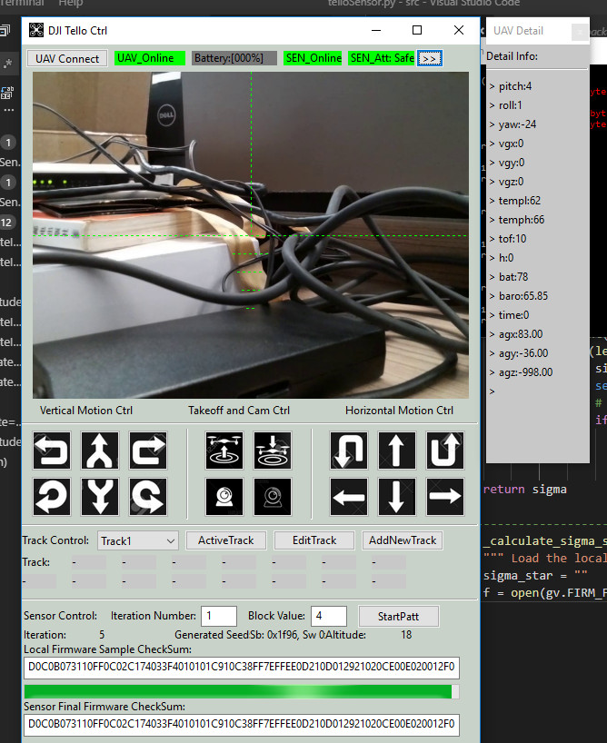
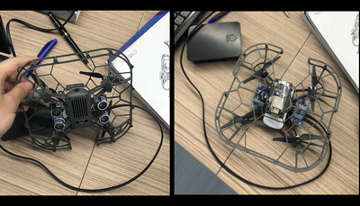
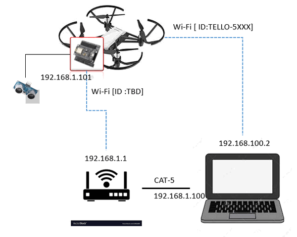
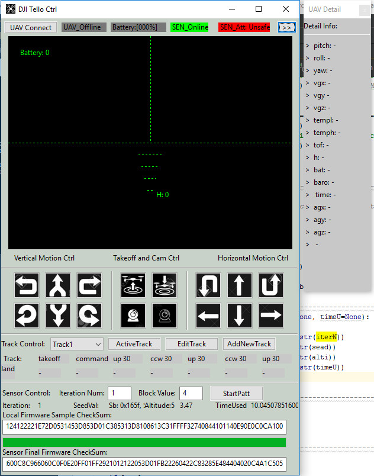

# DJI_Tello_Control [Drone Firmware Attack and Detection]

**Program Design Purpose**: The objective of this cyber attack case study is to develop a workshop which use the terrain matching drone program and the firmware attestation algorithm introduced in paper [PAtt: Physics-based Attestation of Control Systems](https://www.usenix.org/system/files/raid2019-ghaeini.pdf)  for demonstrating the IoT/OT device firmware attack and the attack detection. The terrain matching drone is build by four distance sensors and DJI Tello Drone.

**Attacker Vector** : Malicious Firmware Updates (OT), IoT Supply Chain Attacks

> Important : The demonstrated attack case is used for education and training for different level of IT-OT cyber security ICS course, please don't apply it on any real world system.

[TOC]

------

### Introduction

This project contains two sections: 

- DJI Tello Terrain Matching Drone Control 
- Arduino Firmware Attestation

#### DJI Tello Terrain Matching Drone Control 

In this project we add four additional distance detection sensor under a DJI Tello drone, then we use the Tello's bottom sensor and the 4 distance sensors to generate the drone bottom ground contour map, then our main drone controller will control the drone based on the contour map. For example, if we want the drone fly straight until detect a table sharp item under it, the drone will keep send the contour map to control program and if the program detect that the can match pre-saved table's feature, the control program will send the landing command to the drone. A typical terrain matching process is shown below : 


In this section we will also create a DJI Tello Drone controller program with the drone basic motion control, track editing function, ground simple contour matching function and drone motion safety check function for user to plan complex route for the drone to follow.

#### Arduino Firmware Attestation

In this section we will create a firmware program running on the ESP8266 Arduino to read the distances data from four HC-SR04 Ultrasonic Sensor to do the fly environment monitoring, terrain matching function. We will follow part of the PLC firmware attestation algorithm introduced in the paper "PATT" PATT: Physics-based Attestation of Control Systems (from Dr.Hamid Reza Ghaeini and Professor Jianying Zhou)  to verify whether the firmware attack has happened. We will follow the "Nonce Storage and Hash Computation" part introduced in the paper to dynamically calculate the firmware's hamming hash with the `k=4` as shown below :


#### Key Tactics, techniques, and procedures (TTP) of the attack

Based on the attack detailed road map above, there will be two kinds main TTP included in the firmware attack scenario : 

##### Malicious Firmware Development

- **Tactic:** Develop customized firmware with malicious functionality.
- **Technique:** Modify existing firmware or create new firmware that includes backdoors, exploits, or other malicious code.
- **Procedure:** The Red team attacker modified the normal drone's Terrain Matching unit's firmware by inserting malicious code into the firmware without detection, ensuring it remains hidden and does not trigger security mechanisms.

##### Supply Chain Compromise

- **Tactic:** Compromise the drone's firmware during the manufacturing or distribution process.
- **Technique:** Infiltrate the supply chain to insert malicious firmware before the drone reaches end-users.
- **Procedure:** The Red team build a fake software update server web site and send the link to the drone maintenance engineer via a fake drone firmware update email to introduce the compromised firmware into the supply chain. The web will also provide the Malicious Firmware's MD5 value for the maintenance engineer to do verify the unauthorized firmware update package. 


------

### Background Knowledge 

Within this section, we aim to provide fundamental, general knowledge about each respective system and elucidate the Tactics, Techniques, and Procedures (TTP) associated with the attack vectors. This foundational information will serve as a primer for understanding the intricate details of the systems involved and the methodologies employed in the attack scenarios.

#### Firmware Attack

A **firmware attack** is any malicious code that enters your device by using a backdoor in the processor’s software. Backdoors are paths in the code, which allow certain individuals to bypass security and enter the system. The backdoor normally goes undetected due to its intense complexity, but can result in serious consequences if exploited by [hackers](https://netacea.com/blog/crackers-arent-hackers/).

A common example of a firmware attack is an unauthorized update on your computer or phone that results in [malware](https://netacea.com/glossary/malware/) or some other form of cybercriminal activity. This is because many updates include backdoors with undocumented features or functions that can be used for adverse actions, such as intercepting data without notice and turning off core functionalities; all while still masquerading itself as an innocent update process.

>  Reference link: https://netacea.com/glossary/firmware-attack/


#### DJI Tello Drone Control and Terrain Matching 

We installed four HC-SR04 Ultrasonic Sensors under a DJI Tello Drone (as shown below), then we use a ESP8266 Arduino's GPIO pin (D1, D2, D3 ns D4) to connect to the sensor's data positive (+) pin and connect all the sensor data negative/basic (-) pin to GPIO pin D0. Then use the Arduino to read the distance data and average the data to get a stable 4 points drone bottom area contour map every 0.5 second.


We also provide a control program with all the trojan flight control function. The  ESP8266 will send the 4 points drone bottom area contour map back to the control program and combine with the drone's bottom height sensor's reading, then we build a 5 points  drone bottom area contour map: 


Then the control will compare the final drone bottom area contour map with the its pre-saved contour map, if the different in under the threshold, then the control program will detect the "Terrain Matched", after the Terrain Matched last for 2 seconds, the control will send the preset the flight action time line (rout plat book) to the drone. (such as instruct the drone landing on the surface)


**Demo Link**: 

https://www.youtube.com/watch?v=rRu1qrZohJY

```
[](https://www.youtube.com/watch?v=rRu1qrZohJY "Demo video ")
```

##### Program Main UI View

The main user interface to control the drone and check the sensor state is shown below:



##### Hardware View (Done with sensors installed)

The Two sensors doing terrain matching are mounted under the drone as shown below:



`version: v_0.2`


------

### Program Setup

###### Development Environment

> Python 3.7.4, C

###### Additional Lib Need

1. wxPython 4.0.6 (need to install for UI building) 

[wxPython]: https://wxpython.org/pages/downloads/index.html:	"wxPython"

```
pip install -U wxPython 
```

2. OpenCV: opencv-python 4.1.1.26  (need to install to do the H264 video stream decode)

[openCV on Wheel]: https://pypi.org/project/opencv-python/:	"OpenCV"

```
pip install opencv-python
```

###### Hardware Need

We use DJI Tello Drone, ESP8266 Arduino and HC-SR04 Ultrasonic Sensor to build the system: 


[DJI Tello ]: https://www.ryzerobotics.com/tello/downloads	"DJI tello control SDK"
[ESP8266 Arduino ]: https://arduino-esp8266.readthedocs.io/en/latest/	"ESP8266 Arduino dev doc"
[HC-SR04 Ultrasonic Sensor ]: https://cdn.sparkfun.com/datasheets/Sensors/Proximity/HCSR04.pdf	"DJI tello control SDK"


------

### System Design

##### Communication Protocol 

The control hub (Computer) will control with the drone by UDP and fetch the feedback data of the sensor by TCP:

| The program will connect to the Arduino by TCP and communicate with the drone by UDP |
| ------------------------------------------------------------ |
| **Arduino  Control**:  Arduino_IP: 192.168.1.101, TCP_PORT: 4000 <<- ->>  PC_IP: 192.168.1.100 TCP_PORT: 4000 |
| **Drone Control** (Send Command & Receive Response):  Tello_IP: 192.168.10.1  UDP_PORT:8889  <<- ->>  PC/Mac/Mobile_IP: 192.168.10.xx UDP_PORT:8889 |
| **Drone Control** (Receive Tello State): Tello_IP: 192.168.10.1  UDP_PORT:8890 ->>  PC/Mac/Mobile_ UDP_Server: 0.0.0.0, UDP PORT:8890 |
| Drone Control (Receive Tello Video Stream) :  Tello_IP: 192.168.10.1, UDP_PORT:11111->>  PC/Mac/Mobile_UDP_Server: 0.0.0.0,  UDP_PORT:11111 |

**Communication detail diagram is shown below**: 


###### WI-FI Connection Diagram

The Tello drone will connect the computer by WI-FI. The Arduino will connect to a router first then connect to the computer. The connection diagram is shown below: 



###### Program Executions Diagram

The main thread will start three parallel sub-thread to communicate with the Arduino, read the Tello states data and get the Tello's UDP Video stream. The main thread will handle the Tello control. Program execution UML diagram: 


##### Program File List 

| Program File          | Execution Env | Description                                                  |
| --------------------- | ------------- | ------------------------------------------------------------ |
| esp_client.ino        | C(Arduino)    | This module will start a TCP client to send the HC-SR04 Ultrasonic Sensor reading to server and send the firmware checksum for attestation. |
| esp_client_attack.ino | C(Arduino)    | Attack firmware: It has the same function as the file <esp_client.ino>, but if we compile this program and load the firmware in to the Arduino, the sensor feed back will be set to a fixed number. |
| telloGlobal.py        | python3.7.4   | This module is used as a Local config file to set constants and global parameters which will be used in the other modules. |
| TelloPanel.py         | python 3.7    | This module is used to create the control and display panel for the UAV system (drone control and sensor firmware attestation). |
| TelloRun.py           | python 3.7    | This module is used to create a controller for the DJI Tello Drone and connect to the Arduino_ESP8266 to get the height sensor data. |
| telloSensor.py        | python 3.7    | This module is used to create a TCPcommunication server to receive the Arduino_ESP8266 height data and do the PATT attestation. |
| TrackPath.txt         |               | Edit the drone fly path.                                     |


------

### Program Usage/Execution

##### Run the Program

Follow the section "WIFI Connection Diagram" to connect to the sensor and drone to your computer. Then execute the program telloRun.py under `src` folder by the below command: 

```
python telloRun.py
```

After the program initialization finished, the below message will show in your terminal: 

```
"Program init finished."
```

 Then the main UI will show as below: 


##### Control the drone, sensor and do the firmware attestation

1. Click the "**UAV Connect**" button under the title line, if the done responses correctly the "drone state" indicator in UI will change to green and the indicator will show "**UAV_Online**".

2. The sensor will connect to the program automatically. When the ESP8266 Arduino connected to the program, the sensor indicator will change to green and show "**SEN_Online**". 

3. Press the white '**Camera**' button under "**Takeoff and Cam Ctrl**" will turn on the drone's front camera.

4. The latest battery reading will be shown on the left-top corner of the front camera view panel and the height of the drone will be shown on the right side of the the lowest skyline horizontal indicator. The battery reading show in the title bar is the average reading in the passed 10 seconds. 

5. Drone track path planning: 
   - Add a track: Open the track record file "`TrackPath.txt`" (under `src` folder)  and add the track by below format:
   
  > TrackName**;**action 1**;**action x**;**action x**;**action x**;**action x**;**action x**;**land (example:*Track1;takeoff;command;up 30;ccw 30;up 30;ccw 30;up 30;land* .

     >  If you don't set the land cmd, the program will add the land cmd automatically. For the action setting part, please check the detail drone control protocol in Tello SDK Documentation EN_1.3_1122.pdf under doc folder ) 

   - Select the track in the drop down menu and click the "**Active track**" button, the selected track will by executed by the drone. The current executed action will be marked as green color. 

6. Sensor Firmware Attestation Control:  

   - Fill attestation times you want to do and the memory block size, then press the "**startPatt**" button. The local firmware and the sensor firmware will be shown and compared. The attestation result and total time used for the attestation process will be shown as below (The attestation process will take about 8sec ~ 10 sec): 

   - 

   - Every attestation result will be record in the "checkSumRecord.txt" (source folder) under format: 

     checksum record [2019-10-18 12:18:30.305437]:

     Local:`1400A0C126221302030000340C21865C1014050020C0313FBEE0CD0C0B073110FF0C02C174033F4010101C910C38FF7EFFEE0D210D012921020CE00E020012F0`

     Remote:`1400A0C126221302030000340C21865C1014050020C0313FBEE0CD0C0B073110FF0C02C174033F4010101C910C38FF7EFFEE0D210D012921020CE00E020012F0`

     

7. Press the '**>>**' button under the title bar the drone detail status information display window will pop-up on the right.

------

### Problem and Solution

N.A

------

### Reference

PATT firmware attestation: 

https://www.usenix.org/system/files/raid2019-ghaeini.pdf


------

> Last edit by LiuYuancheng(liu_yuan_cheng@hotmail.com) at 29/01/2020