# DJI_Tello_Control [Drone Firmware Attack and Detection]

**Program Design Purpose**: The objective of this cyber attack case study is to develop a workshop which uses the terrain matching drone program and the firmware attestation algorithm introduced in paper [PAtt: Physics-based Attestation of Control Systems](https://www.usenix.org/system/files/raid2019-ghaeini.pdf)  for demonstrating the IoT/OT device firmware attack and the attack detection. The terrain matching drone is built by four distance sensors and a DJI Tello Drone. The attack scenario will show red team attacker add in some malicious code in the firmware of the drone's terrain contour generate unit, then mess up the drone's landing process and caused the drone crash happen. At the same time we will also show how the blue team defenders use the PATT firmware attestation function to detect the firmware attack during the drone operation time and avoid the accident.

**Attacker Vector** : Malicious Firmware Updates (OT), IoT Supply Chain Attacks

> Important : The demonstrated attack case is used for education and training for different level of IT-OT cyber security ICS course, please don't apply it on any real world system.

[TOC]

------

### Introduction

In this study case, we want to build a smart drone system which can simulate some special auto pilot task used in I4.0 such as auto tracing the route, sense environment (Terrain Matching)  and make decision of next task. Then we will show how a OT firmware attack will make influence of the system. This project contains three sections: 

- **Attack Demo Platform**: DJI Tello Terrain Matching Drone Control System
- **Firmware Attack demo**: Ground Contour Map Generator firmware attack demo
- **Attack detection and defense**: Arduino Ground Contour Map Generator Unit Firmware Attestation


#### DJI Tello Terrain Matching Drone Control 

In this project we want to build a drone with some special function by using the DJI unprogrammable mini drone so it can simulate the industry drone's action such as follow the route and transfer items in the factory. The DJI Tello drone is a very basic version unprogrammable drone, so we will extend its function via adding more sensor on it to make it can "detect" more complex environment and use the computer to do the auto-pilot control.

We added four additional distance detection sensors at the bottom of the DJI Tello drone, then we use the Tello's bottom sensor and the 4 distance sensors to generate the "5 points" drone bottom ground contour map. Our main drone controller(running on the control computer) will control the drone to simulate drone auto pilot and trace route based on the contour map data. For example, if we want the drone fly straight until detect a table sharp item under it then land on the the table (simulate drone transfer deliver item from one table to another table), the drone will keep send the contour map to control program and if the program detect that the send back contour matrix can match the program pre-saved table's feature, the control program will send the landing command to the drone. A typical terrain matching process is shown below : 

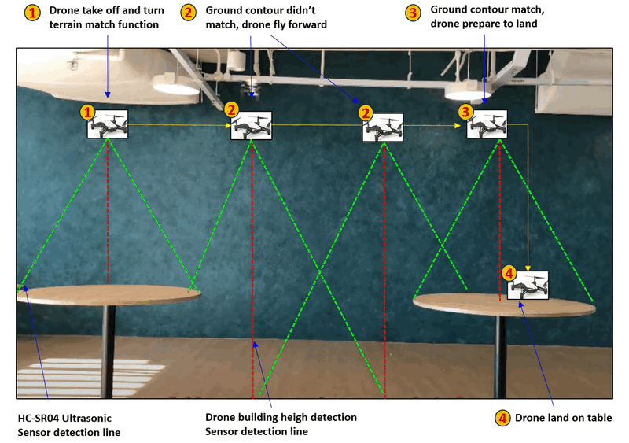

In this section we will also show the DJI Tello Drone controller program with the drone basic motion control, track editing function, ground simple contour matching function and drone motion safety check function for user to plan complex route for the drone to follow.


#### Firmware Attack Demo

In this firmware attack case, the red team attacker's target is the  firmware program running on the drone's contour map generation unit which is used to do the fly environment monitoring, terrain matching function. . The contour map generation unit is build by a ESP8266 Arduino + a battery + four HC-SR04 Ultrasonic Sensors, the battery and Arduino are attached on the top of the drone and the 4 sensors are installed at the bottom of the drone. 

The attack path is shown below : 

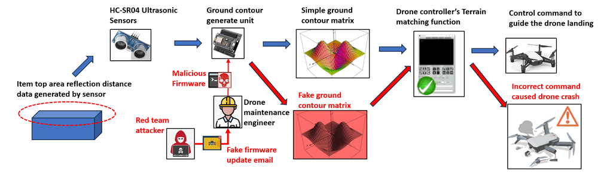

During the attack scenario, the attacker used one weak point of the IoT Supply Chain which send a fake firmware update email to a careless drone maintenance engineer and caused the malicious firmware be load in the drone's contour map generation unit. The malicious firmware will act normally if the user is do manual drone control or just auto follow the route, it will active when the drone start the auto pilot to do the ground contour matching. The firmware will random generate the "noisy" distance data to make ground contour information not accuracy, the incorrect contour matrix information will misleading the drone controller make wrong decision which will cause the drone accident such as crash. 

> The detail demo video : https://youtu.be/rRu1qrZohJY?si=g5fkKZf4Z8Osre6I


#### Arduino Firmware Attestation

In this section we will show because of the careless drone maintenance engineer the fake malware attack has happened, how a drone operator can use the dynamic running time firmware attestation to detect the attack and avoid the drone's accident happens.  

We will follow part of the PLC firmware attestation algorithm introduced in the paper "PATT" PATT: Physics-based Attestation of Control Systems to verify whether the firmware attack has happened. We will follow the "Nonce Storage and Hash Computation" part introduced in the paper to dynamically calculate the firmware's hamming hash with the `k=4` as shown below :

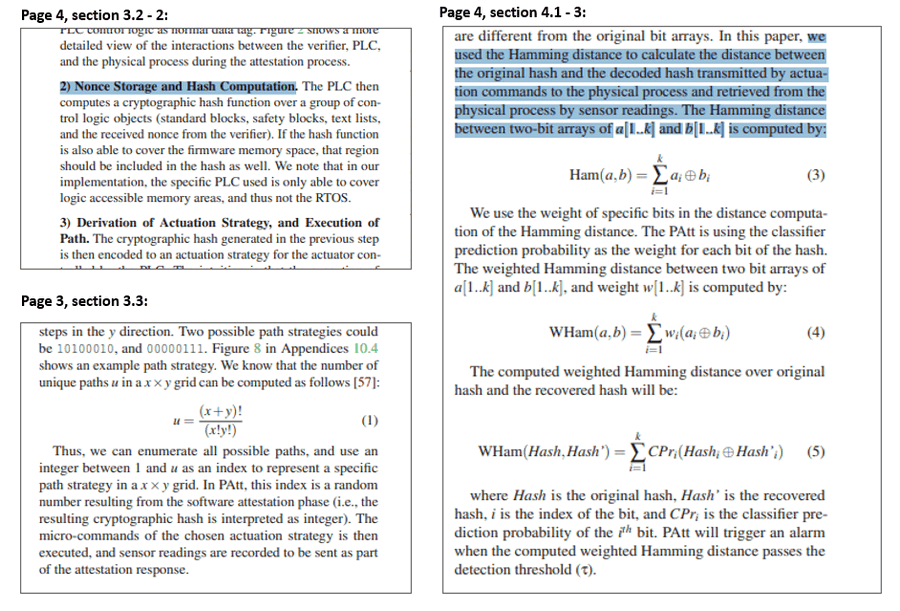

We want to say many thanks for Dr.Hamid Reza Ghaeini and Professor Jianying Zhou from Singapore SUTD introduce the fast and robust attestation logic in the PATT: Physics-based Attestation of Control Systems paper. 


#### Key Tactics, techniques, and procedures (TTP) of the attack

Based on the attack detailed road map introduced in the attack demo section, there will be two kinds main TTP included in the firmware attack scenario : 

##### Malicious Firmware Development

- **Tactic:** Develop customized firmware with malicious functionality.
- **Technique:** Modify existing firmware or create new firmware that includes backdoors, exploits, or other malicious code.
- **Procedure:** The red team attacker modified the normal drone's Terrain Matching unit's firmware by inserting malicious code into the firmware without detection, ensuring it remains hidden and does not trigger security mechanisms.

##### Supply Chain Compromise

- **Tactic:** Compromise the drone's firmware during the manufacturing or distribution process.
- **Technique:** Infiltrate the supply chain to insert malicious firmware before the drone reaches end-users.
- **Procedure:** The Red team build a fake software update server web site and send the link to the drone maintenance engineer via a fake drone firmware update email to introduce the compromised firmware into the supply chain. The web will also provide the Malicious Firmware's MD5 value for the maintenance engineer to do verify the unauthorized firmware update package. 


------

### Background Knowledge 

Within this section, we aim to provide fundamental, general knowledge about each respective system and elucidate the Tactics, Techniques, and Procedures (TTP) associated with the attack vectors. This foundational information will serve as a primer for understanding the intricate details of the systems involved and the methodologies employed in the attack scenarios.

#### DJI Tello Drone Control and Terrain Matching 

Before we introduce the attack technology background knowledge, we need to introduce the plant form we build for our attack case, the DJI Tello Drone Terrain Matching system.  

To change a normal unprogrammable drone to be a "smart" drone. We installed four HC-SR04 Ultrasonic Sensors under the DJI Tello Drone (as shown below), then we use a ESP8266 Arduino's GPIO pin (`GPIO5-D1`, `GPIO4-D2`, `GPIO0-D3` and `GPIO2-D4`) to connect to the sensor's data positive (+) pin. Then the contour map generation code running on  Arduino will read the distance data and average the data to get a stable 4 points drone bottom area contour map every 0.5 second.

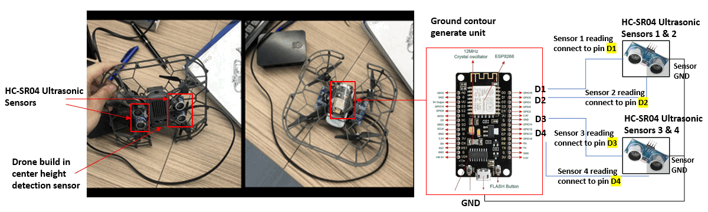

We also provide a control program with all the trojan flight control function. The  ESP8266 will send the 4 points drone bottom area contour map back to the control program and combine with the drone's bottom height sensor's reading, then we build a 5 points drone bottom area contour map as shown below: 

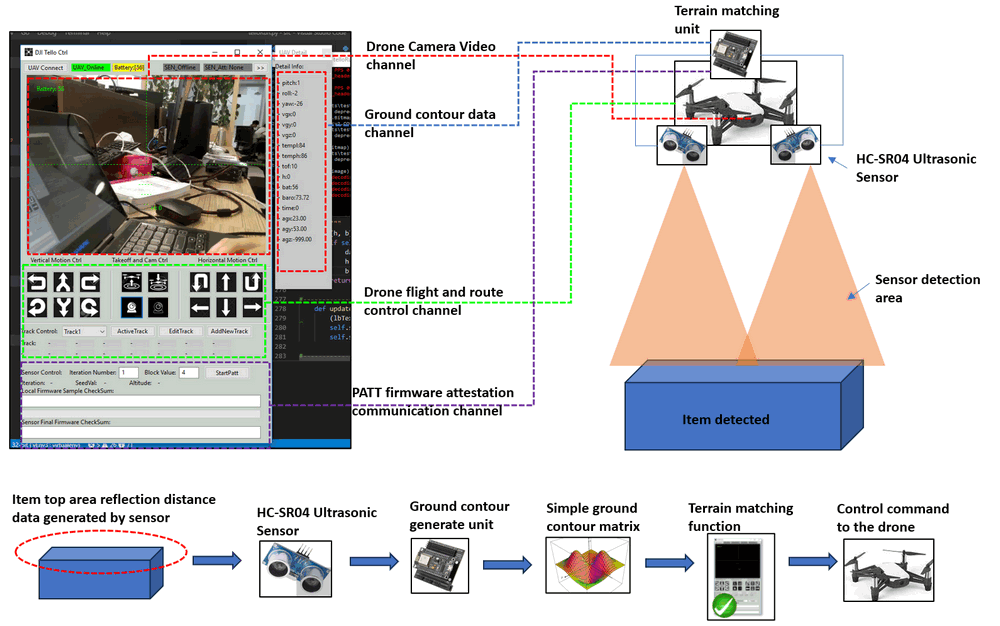

The drone controller's Terrain Matching module will compare the final drone bottom area contour map with its pre-saved contour map matrix, if the difference is under the threshold, then the control program will detect the "Terrain Matched", after the Terrain Matched last for 2 seconds, the control will send the pre-set the flight action time line (rout plat book) to the drone. (such as instruct the drone landing on the surface)


#### Firmware Attack

A **firmware attack** is any malicious code that enters your device by using a backdoor in the processor’s software. Backdoors are paths in the code, which allow certain individuals to bypass security and enter the system. The backdoor normally goes undetected due to its intense complexity, but can result in serious consequences if exploited by [hackers](https://netacea.com/blog/crackers-arent-hackers/).

A common example of a firmware attack is an unauthorized update on your computer or phone that results in [malware](https://netacea.com/glossary/malware/) or some other form of cybercriminal activity. This is because many updates include backdoors with undocumented features or functions that can be used for adverse actions, such as intercepting data without notice and turning off core functionalities; all while still masquerading itself as an innocent update process.

>  Reference link: https://netacea.com/glossary/firmware-attack/

During the attack demo, the red team attacker's target is the firmware of the ground contour generate unit (as shown in the pre-section), the attack will add malicious code in the distance sensor data reading part to add the random offset of the real data to mess up the ground contour generation result. Before the attack, the drone will fly straight until till find another table which match its pre-saved ground contour (identify as a safe landing plan) then land on the table. After the firmware attack, after messed up the ground contour generation result, a unsafe place's contour matrix data will be identify as a matching result, the the drone will try to land and crash. (As shown in the demo video) 


#### PAtt: Physics-based Attestation of Control Systems

PAtt is designed to allow remote attestation of logic code running on a PLC without a traditional trust anchor (such as a TPM or PUF), For the PAtt: Physics-based Attestation of Control Systems please refer to  Dr.Hamid Reza Ghaeini and Professor Jianying Zhou's Paper: https://www.usenix.org/system/files/raid2019-ghaeini.pdf

In our project we followed We will follow the "Nonce Storage and Hash Computation" part introduced in the paper to dynamically calculate the firmware's hamming hash with the `k=4` to verify the firmware running on ESP8266 Arduino. 


------

### System Design 

In this section we will introduce four main section design of the system:

- Drone Controller UI design
- Communication Protocol Design 
- Design of Malicious Code and the Firmware Attack
- Design of the Firmware Attestation 

The drone controller main thread will start three parallel sub-threads to communicate with the Arduino to fetch the data and do the firmware attestation,read the Tello states data and get the Tello's UDP Video stream. The main thread will handle the Tello control.


#### Drone Controller UI design 

The drone controller user interface contents four main panel as shown below:

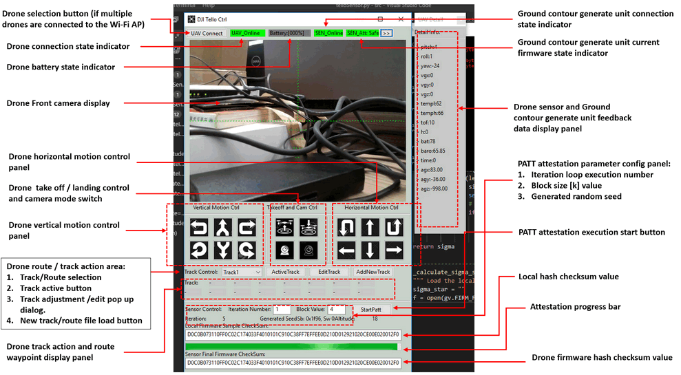

The Drone control UI contents 6 different function panel: 

- **Drone state panel** : Top panel of the UI to allow the drone operator to select drone, check the drone connection and battery state, the ground contour generate unit connection state, firmware attestation state and view the drone front camera. 
- **Drone flight control panel** : Drone manual flight control panel to control the drone's vertical / horizontal movement , row pitch yaw adjustment, take off and landing and the camera on / off. 
- **Drone autopilot control panel** : Panel for drone operator to control the drone to auto follow the pre-set rack, edit/load track config file, load the terrain matching config file, display the way point and auto action detail.  
- **Ground contour generator info panel**: Panel to show all the drone's sensor feed back data and the Ground contour generate unit feed back data.
- **PATT parameter config panel** : Panel for the drone operator to config the firmware PATT Hash calculation parameters and start one round attestation progress. 
- **PATT result display panel** : panel to show attestation progress with a progress bar and show the local PATT Hash calculation result and the drone side firmware PATT Hash result when the attestation finished.


#### Communication Protocol Design 

The Drone control computer will connect to the drone via 2 WIFI link: 

- **Drone communication link** : the drone provide a WIFI AP itself, so the controller will connect to the drone directly via WIFI to control the drone. 
- **Ground contour generator link**: the ESP8266 Arduino's a WIFI module to connect to a WIFI AP, so the it will login to the WIFI router which connect to the control computer by Ethernet cable.

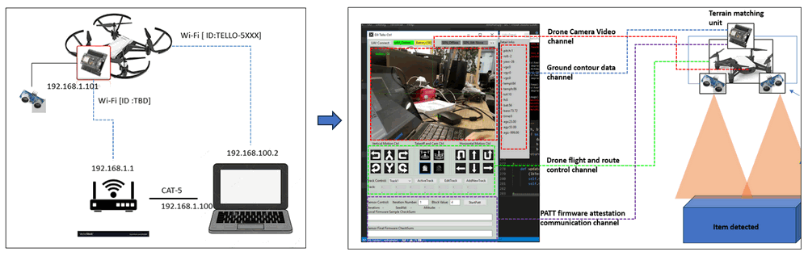

As shown in the above diagram, there are 4 wireless communication channel between the drone controller computer and the Drone. The control hub (Computer) will control with the drone by UDP and fetch the feedback data of Ground contour generator by TCP as shown below:


| Channel Name                          | Data flow                                                    | Target                     | Protocol       | Port  |
| ------------------------------------- | ------------------------------------------------------------ | -------------------------- | -------------- | ----- |
| Ground contour generator data channel | Fetch the ground contour matrix data from sensor             | Arduino_IP (192.168.1.101) | TCP            | 4000  |
| Drone motion control channel          | Send drone flight controm Command & Receive Response         | Tello_Drone(192.168.10.1)  | UDP            | 8889  |
| Drone sensor data channel             | Fetch drone built in bottom height sensor, flight sensor, battery , gyroscope data | Tello_Drone(192.168.10.1)  | UDP            | 8890  |
| Drone Video channel                   | Drone front camera video                                     | Tello_Drone(192.168.10.1)  | UDP H264 video | 11111 |

The gound contour generator firmware attestation communication shared the same channel with the Ground contour generator data channel, so when the attestation start, the Ground contour generation function will temporary paused and the channel will be used for transfer the PATT data. 

| The program will connect to the Arduino by TCP and communicate with the drone by UDP |
| ------------------------------------------------------------ |
| **Arduino  Control**:  Arduino_IP: 192.168.1.101, TCP_PORT: 4000 <<- ->>  PC_IP: 192.168.1.100 TCP_PORT: 4000 |
| **Drone Control** (Send Command & Receive Response):  Tello_IP: 192.168.10.1  UDP_PORT:8889  <<- ->>  PC/Mac/Mobile_IP: 192.168.10.xx UDP_PORT:8889 |
| **Drone Control** (Receive Tello State): Tello_IP: 192.168.10.1  UDP_PORT:8890 ->>  PC/Mac/Mobile_ UDP_Server: 0.0.0.0, UDP PORT:8890 |
| **Drone Control** (Receive Tello Video Stream) :  Tello_IP: 192.168.10.1, UDP_PORT:11111->>  PC/Mac/Mobile_UDP_Server: 0.0.0.0,  UDP_PORT:11111 |


#### Design of Malicious Code and the Firmware Attack 

The red team attacker will follow below step to do the firmware attack

The red team attacker download the normal firmware file `esp_client.ino.generic.bin` from authorized firmware server.  

red team attacker user reverse engineer tool decompiled the binary to get part of the firmware C++ source code. 

Then he analysis the code find the way to calculate the distance is we use the sensor generate a sound pulse, then measured the time interval between send the pulse and get the echo, then we multiple the time with the speed of sound and divided by 2. After he understand of the logic, the red team attacker added the malicious code in is as shown below: 

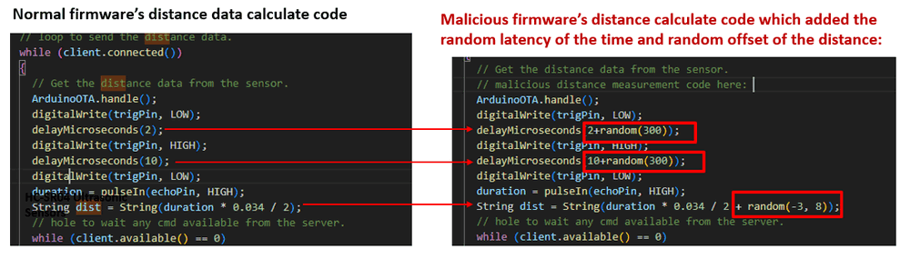

As shown in the malicious code the attacker added a random delay (0 ~300 microsec) before and after the pulse to make the echo time not consistent, then also add a random value (-3, 8) to the distance result make the final result have a random offset between -30cm to 80 cm. 

After added the malicious code, the attacker repackage the fake firmware and send to the drone maintenance engineer via a fake ground contour generate unit firmware update email. 

The maintenance engineer load the firmware to the ground contour generate unit, and he turn on the power and there some feedback data and as he didn't make the drone take off the distance data "looks" ok, so he thought the firmware is working normally which is actually not. As shown below,  the difference of the contour map send back to the controller :

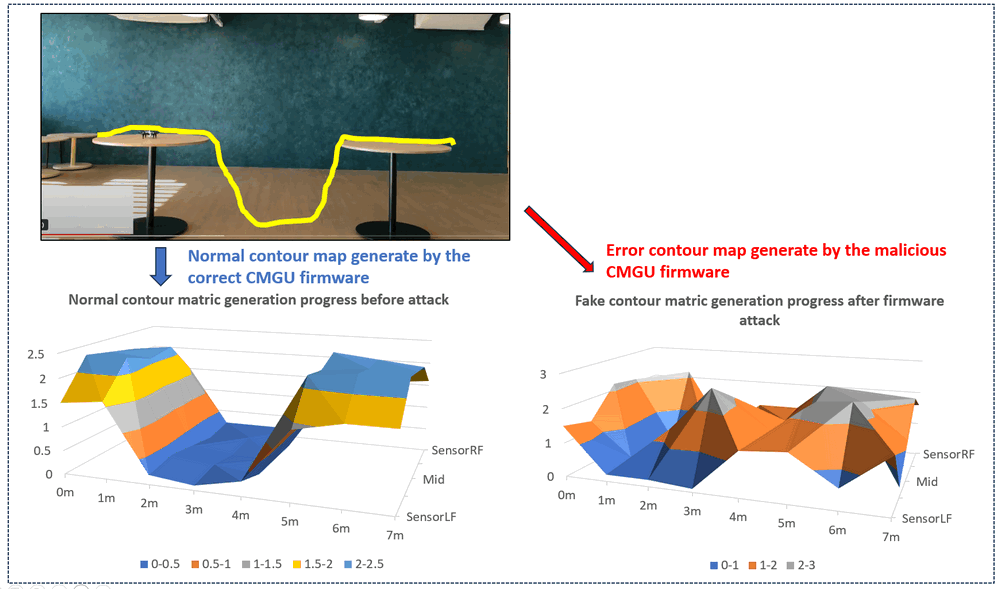

When the drone operator uses the drone to do some task such as transfer some thing from one table to another table, when the drone take off, its ground contour generate unit keep generate fake distance data which caused the drone landing on the ground or crash. 


#### Design of the Firmware Attestation 

To verify the firmware, both the control computer side will keep a copy of valid firmware and simulate the firmware loading to memory which same as the Arduino. The detailed attestation steps are shown below: 

- When we start to do the firmware attestation, the controller will fetch the firmware version and serial number from the Arduino. Based on the firmware version and serial number the control program will go to its data base to fetch the related firmware, firmware memory config and the random memory addresses list generation function from its data base.  
- After fetched all the related information, the controller side will generate a "twin" memory map which is same as the target memory and load the firmware in the memory. After this prepare works done, it will create a random seed and send the seed to the Arduino. 
- Both controller and the firmware side will used the same random seed and the random memory addresses list generation function to generate a random memory address list. After the list finished both controller side and the Arduino will calculate the Ham(a, b) for every address in the address list. Assume a address in the list is `0x7FFF5FBFFD98` "a" is the contents in from `0x7FFF5FBFFD98`  to `0x7FFF5FBFFD98+k` , after all the Ham(a,b) are calculated, we will combine all the Ham(a,b) together and get the hash value to do one round iteration. Based on the iteration parameter setting, after finish all the iteration,  all the hash value will combined together to generate the PATT checksum value. 
- The Arduino will send back the PATT checksum back to the controller though the ground contour channel , if the send back checksum is same as the controller's checksum, the firmware attestation is passed, else firmware attack will be detected. 

The main communication flow is shown below (System execution workflow UML diagram) :

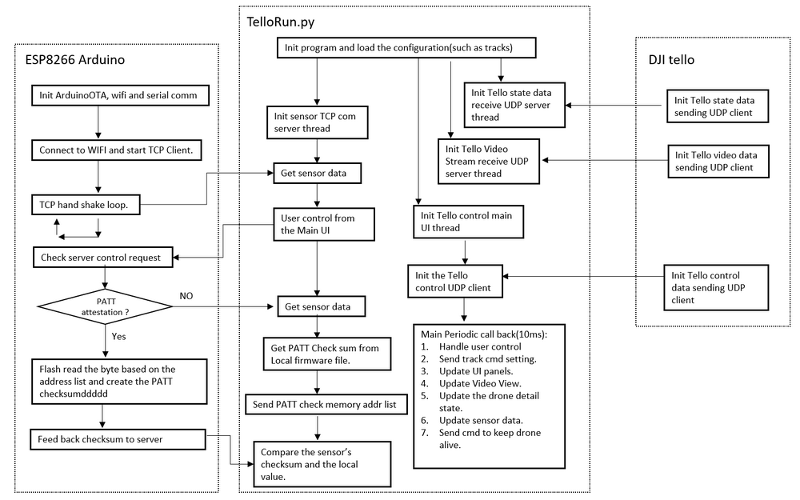


------

### Program Setup

###### Development Environment

> Python 3.7.4, C++

###### Additional Lib Need

1. wxPython 4.0.6 (need to install for UI building) [> link](https://wxpython.org/pages/downloads/index.html:)

```
pip install -U wxPython 
```

2. OpenCV: opencv-python 4.1.1.26  (need to install to do the H264 video stream decode) [> link](https://pypi.org/project/opencv-python/)

```
pip install opencv-python
```

###### Hardware Need

We use DJI Tello Drone, ESP8266 Arduino and HC-SR04 Ultrasonic Sensor to build the system: 


- **DJI Tello Drone** : DJI tello control SDK [> link ](https://www.ryzerobotics.com/tello/downloads ) 
- **ESP8266 Arduino** : ESP8266 Arduino dev doc [> link](https://arduino-esp8266.readthedocs.io/en/latest/)
- **HC-SR04 Ultrasonic Sensor** : Product features doc [> link](https://cdn.sparkfun.com/datasheets/Sensors/Proximity/HCSR04.pdf)


##### Program File List 

| Program File          | Execution Env | Description                                                  |
| --------------------- | ------------- | ------------------------------------------------------------ |
| esp_client.ino        | C(Arduino)    | This module will start a TCP client to send the HC-SR04 Ultrasonic Sensor reading to server and send the firmware checksum for attestation. |
| esp_client_attack.ino | C(Arduino)    | Attack firmware: It has the same function as the file <esp_client.ino>, but if we compile this program and load the firmware in to the Arduino, the sensor feed back will be set to a fixed number. |
| telloGlobal.py        | python3.7.4   | This module is used as a Local config file to set constants and global parameters which will be used in the other modules. |
| TelloPanel.py         | python 3.7    | This module is used to create the control and display panel for the UAV system (drone control and sensor firmware attestation). |
| TelloRun.py           | python 3.7    | This module is used to create a controller for the DJI Tello Drone and connect to the Arduino_ESP8266 to get the height sensor data. |
| telloSensor.py        | python 3.7    | This module is used to create a TCPcommunication server to receive the Arduino_ESP8266 height data and do the PATT attestation. |
| TrackPath.txt         |               | Edit the drone fly path.                                     |


------

### Program Usage/Execution

##### Run the Program

Follow the section "WIFI Connection Diagram" to connect to the sensor and drone to your computer. Then execute the program telloRun.py under `src` folder by the below command: 

```
python telloRun.py
```

After the program initialization finished, the below message will show in your terminal: 

```
"Program init finished."
```

 Then the main UI will show as below: 

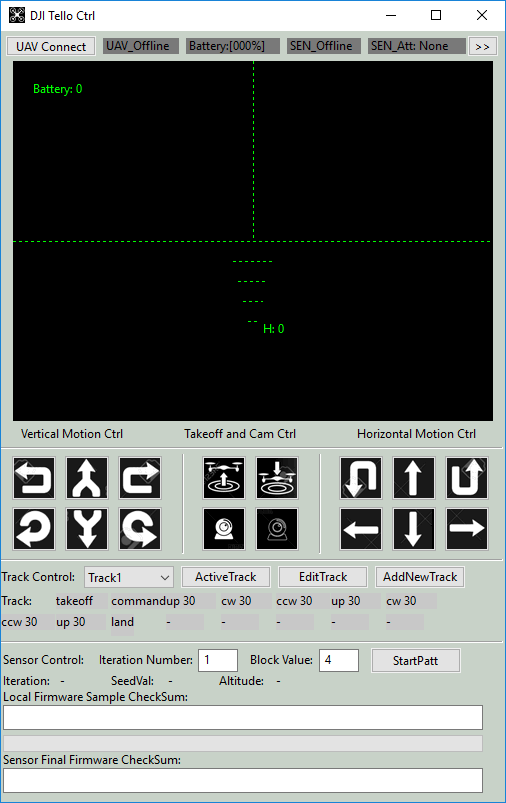

##### Load the ground matric file

To active the Terrain Matching function, the operate needs to change the config file's Terrain Matching flag to `True` after that when start the UI, the loading button will show up. Then Press the "loadCont" button the count file will pop up. 

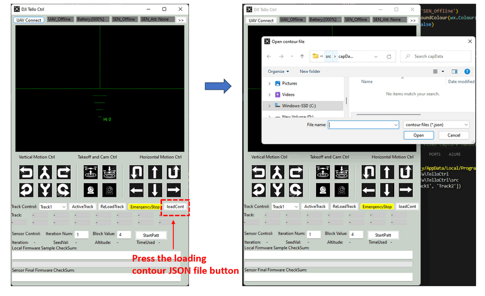

select the contour file you want to match, one simple contour example is shown below:

```
{
	"sensorLF"	: [1.33, 1.23]	# The drone left front sensor reading 
	"sensorLB"	: [1.33, 1.24] 	# the drone left back sensor reading	
	"sensorMD"	: [1.12, 1.20]	# the fone mid height sensor reading
	"sensorRF"	: [1.33, 1.23] 	# The drone right front sensor reading 
	"sensorRB"	: [1.33, 1.24] 	# the drone right back sensor reading
	"threshold" : 0.15			# matching threshod
	"matchingT" : 2				# time to trigger matching (second)
	"tackID"	: "trackLanding" # track to be executed after terrain matched.
}
```


##### Control the drone, sensor and do the firmware attestation

The drone operator can do the attestation during the drone is flying, but we recommend drone operator do the attestation before the drone take off. The detailed step to do one attestation is shown below:

1. Click the "**UAV Connect**" button under the title line, if the done responses correctly the "drone state" indicator in UI will change to green and the indicator will show "**UAV_Online**".

2. The sensor will connect to the program automatically. When the ESP8266 Arduino connected to the program, the sensor indicator will change to green and show "**SEN_Online**". 

3. Press the white '**Camera**' button under "**Takeoff and Cam Ctrl**" will turn on the drone's front camera.

4. The latest battery reading will be shown on the left-top corner of the front camera view panel and the height of the drone will be shown on the right side of the the lowest skyline horizontal indicator. The battery reading show in the title bar is the average reading in the passed 10 seconds. 

5. Drone track path planning: 
   - Add a track: Open the track record file "`TrackPath.txt`" (under `src` folder)  and add the track by below format:
   
  > TrackName**;**action 1**;**action x**;**action x**;**action x**;**action x**;**action x**;**land (example:*Track1;takeoff;command;up 30;ccw 30;up 30;ccw 30;up 30;land* .

     >  If you don't set the land cmd, the program will add the land cmd automatically. For the action setting part, please check the detail drone control protocol in Tello SDK Documentation EN_1.3_1122.pdf under doc folder ) 

   - Select the track in the drop down menu and click the "**Active track**" button, the selected track will by executed by the drone. The current executed action will be marked as green color. 

6. Sensor Firmware Attestation Control:  

   - Fill attestation times you want to do and the memory block size, then press the "**startPatt**" button. The local firmware and the sensor firmware will be shown and compared. The attestation result and total time used for the attestation process will be shown as below (The attestation process will take about 8sec ~ 10 sec): 

   - 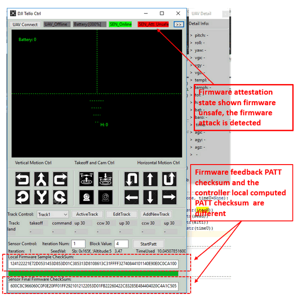

   - Every attestation result will be record in the "checkSumRecord.txt" (source folder) under format: 

     checksum record [2019-10-18 12:18:30.305437]:

     Local:`1400A0C126221302030000340C21865C1014050020C0313FBEE0CD0C0B073110FF0C02C174033F4010101C910C38FF7EFFEE0D210D012921020CE00E020012F0`

     Remote:`1400A0C126221302030000340C21865C1014050020C0313FBEE0CD0C0B073110FF0C02C174033F4010101C910C38FF7EFFEE0D210D012921020CE00E020012F0`

7. Press the '**>>**' button under the title bar the drone detail status information display window will pop-up on the right.

------

### Problem and Solution

N.A

------

### Reference

PATT firmware attestation: 

https://www.usenix.org/system/files/raid2019-ghaeini.pdf


------

> Last edit by LiuYuancheng(liu_yuan_cheng@hotmail.com) at 03/01/2024

