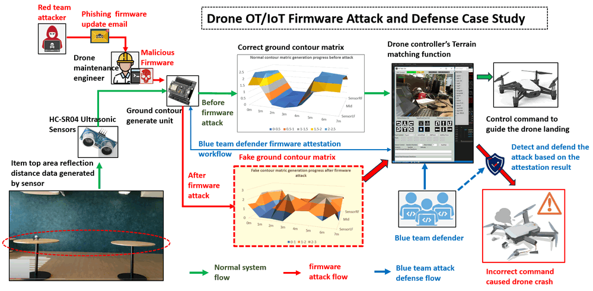
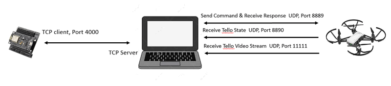
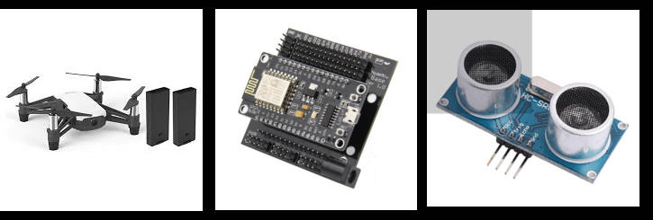

# DJI_Tello_Control_System Cyber Attack Case Study [ Drone Firmware Attack and Detection ]

**Project Design Purpose**: The objective of this cyber attack case study is aim to develop a workshop using the terrain-matching drone system we developed and dynamic firmware attestation algorithm introduced in paper [PAtt: Physics-based Attestation of Control Systems](https://www.usenix.org/system/files/raid2019-ghaeini.pdf) to illustrate a practical demonstration of OT/IoT device firmware attack and the corresponding attack detection mechanisms. The terrain-matching drone is built by one Arduino, four distance sensors and one DJI Tello un-programable drone. The attack scenario involves a red team attacker injecting malicious code into the drone's terrain contour generation unit firmware, disrupting the drone auto landing process, and leading to a simulated drone crash. Simultaneously, the case study also showcases how blue team defenders employ the PATT firmware attestation function to identify the firmware attack in real-time, preventing the accident and highlighting the importance of robust defense mechanisms in securing operational technology and internet of things devices. The attack and detection workflow is shown below:



`version v0.2.1`

**Attacker Vector** : Firmware Attack, Malicious Firmware Updates (OT), IoT Supply Chain Attacks

> Important : The demonstrated attack case is used for education and training for different level of IT-OT cyber security ICS course, please don't apply it on any real world system.

```
version:     v0.2.1
Copyright:   Copyright (c) 2022 LiuYuancheng
License:     MIT License  
```

**Table of Contents**

[TOC]

- [DJI_Tello_Control_System Cyber Attack Case Study [Drone Firmware Attack and Detection]](#dji-tello-control-system-cyber-attack-case-study--drone-firmware-attack-and-detection-)
    + [Introduction](#introduction)
      - [DJI Tello Terrain Matching Drone Control](#dji-tello-terrain-matching-drone-control)
      - [Firmware Attack Demonstration](#firmware-attack-demonstration)
      - [Arduino Firmware Attestation](#arduino-firmware-attestation)
      - [Key Tactics, techniques, and procedures (TTP) of the attack](#key-tactics--techniques--and-procedures--ttp--of-the-attack)
        * [Malicious Firmware Development](#malicious-firmware-development)
        * [Supply Chain Compromise](#supply-chain-compromise)
    + [Background Knowledge](#background-knowledge)
      - [DJI Tello Drone Control and Terrain Matching](#dji-tello-drone-control-and-terrain-matching)
      - [OT/IoT Firmware Attack](#ot-iot-firmware-attack)
      - [PAtt: Physics-based Attestation of Control Systems](#patt--physics-based-attestation-of-control-systems)
    + [System Design](#system-design)
      - [Drone Controller UI design](#drone-controller-ui-design)
      - [Communication Protocol Design](#communication-protocol-design)
      - [Design of Malicious Code and the Firmware Attack](#design-of-malicious-code-and-the-firmware-attack)
      - [Design of the Firmware Attestation](#design-of-the-firmware-attestation)
    + [Program Setup](#program-setup)
          + [Development Environment](#development-environment)
              + [Additional Lib Need](#additional-lib-need)
              + [Hardware Need](#hardware-need)
      
        * [Program File List](#program-file-list)
    + [Program Usage/Execution](#program-usage-execution)
        * [Run the Program](#run-the-program)
        * [Load the ground matrix file](#load-the-ground-matrix-file)
        * [Drone Control and PATT firmware attestation](#drone-control-and-patt-firmware-attestation)
    + [Problem and Solution](#problem-and-solution)
    + [Reference](#reference)


------

### Introduction

This case study aims to develop a smart drone system capable of simulating specific Industry 4.0 (I4.0) drone autopilot use case, including autonomously tracing routes, environment sensing (Terrain matching), transfer items and making decisions for subsequent actions. The objective is to demonstrate the potential impact of an Operational Technology (OT) firmware attack on such a system. The project is structured into three key sections:

- **Attack Demo Platform:** Utilizing the DJI Tello Terrain Matching Drone System as the foundation platform for showcasing autopilot functionalities, potential vulnerabilities and attack scenario.
- **Firmware Attack Demonstration :** Focusing on a demonstration of a malicious firmware update attack targeting the drone's Ground Contour Map Generate Unit. This simulation will highlight the consequences of a malicious intrusion affecting the system's ability to perform tasks effectively.
- **Attack Detection and Defense:** Implementing Physics-based Firmware Attestation(PATT) as a means of illustrating how a robust defense mechanism can detect and mitigate the impact of a firmware attack. This section emphasizes the significance of proactive security measures in safeguarding drone systems within an Industry 4.0 context.


#### DJI Tello Terrain Matching Drone Control 

In this project, our aim is to enhance the capabilities of the DJI Tello mini drone (which is inherently unprogrammable), in order to simulate actions commonly performed by industry drones, such as following predefined routes and transporting items within a factory setting. The DJI Tello drone, being a basic unprogrammable model, requires additional features to emulate more complex tasks. To achieve this, we have integrated four additional ultrasonic sensors onto the drone, enhancing its ability to "detect" a more intricate environment. The autopilot control is executed by a main drone control program running on the connected computer.

The bottom sensor of the DJI Tello, along with the four added distance sensors, collaborates to generate a comprehensive "5 points" ground contour map of the drone's surroundings. The primary drone controller, housed on the control computer, orchestrates the drone's movements to simulate autopilot actions and follow predefined routes based on the acquired contour map data.

The bottom sensor of the DJI Tello, along with the four added distance sensors, collaborates to generate a comprehensive "5 points" ground contour map of the drone's surroundings. The primary drone controller, housed on the control computer, orchestrates the drone's movements to simulate autopilot actions and follow predefined routes based on the acquired contour map data. For instance, if the objective is to make the drone fly straight until it detects an object resembling a table beneath it, and then proceed to land on that table (simulating the transfer of items from one table to another), the drone continually transmits the contour map to the control program. The drone control program analyzes the received contour matrix and if it matches the predefined features of a table, it will issue the landing command to the drone. The typical terrain matching process is illustrated below:


>  **Remark**: In the program design section of this document, we will provide a detailed overview of the DJI Tello Drone controller program. This comprehensive discussion will cover essential aspects, including the intricate usage of drone basic motion control, the functionality of track editing, the ground simple contour matching process, and the drone motion safety check function. This information is intended to empower users with the necessary insights and tools to plan and execute complex routes for the drone, ensuring a seamless and safe operation.


#### Firmware Attack Demonstration 

In this malicious firmware updates attack scenario, the red team attacker's target is the firmware program running on the drone's CMGU (contour map generation unit).  CMGU is crucial for fly environment monitoring and terrain matching, it comprises an ESP8266 Arduino, a battery, and four HC-SR04 Ultrasonic Sensors. During the attack demo, the red team attacker did exploiting a vulnerability in the IoT supply chain, sent a deceptive firmware update email to a negligent drone maintenance engineer, resulting in the installation of the malicious firmware in the contour map generation unit. The attack underscores the critical importance of securing the IoT supply chain to prevent unauthorized firmware alterations and potential operational disruptions. The attack path is shown below : 


The rogue firmware behaves inconspicuously during manual drone control or when following predefined routes. However, it activates malicious functionalities when the drone initiates autopilot mode for ground contour matching. Specifically, the firmware introduces random "noisy" distance data, deliberately distorting the accuracy of ground contour information. This misinformation misguides the drone controller, leading to incorrect decision-making and, consequently, drone accidents such as crashes. 

> The detail demo video : https://youtu.be/rRu1qrZohJY?si=g5fkKZf4Z8Osre6I


#### Arduino Firmware Attestation

In this segment, we will illustrate how a drone operator can employ the dynamic, real-time firmware attestation to not only detect the attack but also prevent potential accidents involving the drone. To achieve this, we adopt a portion of the PLC firmware attestation algorithm outlined in the paper "PATT"( Physics-based Attestation of Control Systems) to verify whether the firmware attack has happened. We will follow the "Nonce Storage and Hash Computation" part introduced in the paper to dynamically calculate the firmware's hamming hash with the `k=4` as shown below :


It's essential to express our thanks for the Physics-based Attestation of Control Systems paper authors Dr.Hamid Reza Ghaeini and Professor Jianying Zhou from [SUTD](https://www.sutd.edu.sg/) for introducing the efficient and robust firmware attestation algorithm. 

> Physics-based Attestation of Control Systems paper link: https://www.usenix.org/system/files/raid2019-ghaeini.pdf


#### Key Tactics, techniques, and procedures (TTP) of the attack

Based on the attack detailed road map introduced in the attack demo section, there will be two kinds main TTP included in the firmware attack scenario : 

##### Malicious Firmware Development

- **Tactic:** Develop customized firmware with malicious functionality.
- **Technique:** Modify existing firmware or create new firmware that includes backdoors, exploits, or other malicious code.
- **Procedure:** The red team attacker modified the normal drone's terrain-matching unit's firmware by inserting malicious code into the firmware without detection, ensuring it remains hidden and does not trigger security mechanisms.

##### Supply Chain Compromise

- **Tactic:** Compromise the drone's firmware during the manufacturing or distribution process.
- **Technique:** Infiltrate the supply chain to insert malicious firmware before the drone reaches end-users.
- **Procedure:** The red team attacker builds a fake software update server web site and send the link to the drone maintenance engineer via a deceptive drone firmware update email to introduce and inject the compromised firmware into the supply chain. The web will also provide the malicious firmware's MD5 value for the maintenance engineer to verify the unauthorized firmware update package. 


------

### Background Knowledge 

Within this section, we aim to provide fundamental, general knowledge about each respective system and elucidate the Tactics, Techniques, and Procedures (TTP) associated with the attack vectors. This foundational information will serve as a primer for understanding the intricate details of the systems involved and the methodologies employed in the attack scenarios.

#### DJI Tello Drone Control and Terrain Matching 

Before delving into the technical aspects of the attack, it's essential to provide an overview of the platform utilized in our case—the DJI Tello Drone Terrain Matching system.

Our aim was to transform a conventional, unprogrammable drone into an intelligent device. To achieve this, we strategically installed four HC-SR04 Ultrasonic Sensors beneath the DJI Tello Drone, as illustrated below. Connecting these sensors to an ESP8266 Arduino's GPIO pins (`GPIO5-D1`, `GPIO4-D2`, `GPIO0-D3`, and `GPIO2-D4`) allowed us to interface with the sensors' data positive (+) pins. The contour map generation code, executed on the Arduino, reads distance data and performs averaging every 0.5 seconds. This process ensures the creation of a stable and accurate 4-point contour map of the drone's bottom area. The battery and Arduino are attached on the top of the drone and the 4 sensors are installed at the bottom of the drone, the hardware design and the wire connection is shown below:


We also developed a UI control program with all the trojan flight control function such as vertical/horizontal movement, flight attitude(row pitch yaw) adjustment and trace route. The ESP8266 will transmitting the 4-points drone bottom area contour map matrix back to the control program and this data is seamlessly integrated with readings from the drone's bottom height sensor for enhancing the precision and versatility of the drone's terrain-matching capabilities. The control program UI and the terrain-matching logic is shown shown below: 


The Terrain Matching module within the drone controller meticulously scrutinizes the generated drone bottom area contour map against its pre-established contour map matrix. If the disparity falls below a predefined threshold, the control program recognizes a successful "Terrain Match." Following a consistent match duration of 2 seconds, the control program initiates the execution of a pre-set flight action timeline or route playbook for the drone. This could include specific instructions, such as directing the drone to perform a landing maneuver on the identified surface.


#### OT/IoT Firmware Attack

A **firmware attack** is any malicious code that enters your device by using a backdoor in the processor’s software. Backdoors are paths in the code, which allow certain individuals to bypass security and enter the system. The backdoor normally goes undetected due to its intense complexity, but can result in serious consequences if exploited by [hackers](https://netacea.com/blog/crackers-arent-hackers/).

A common example of a firmware attack is an unauthorized update on your computer or phone that results in [malware](https://netacea.com/glossary/malware/) or some other form of cybercriminal activity. This is because many updates include backdoors with undocumented features or functions that can be used for adverse actions, such as intercepting data without notice and turning off core functionalities; all while still masquerading itself as an innocent update process.

>  Reference link: https://netacea.com/glossary/firmware-attack/

In the course of the attack demonstration, the red team attacker's focus is on the firmware of the ground contour generation unit, as illustrated in the preceding section. The attack involves injecting malicious code into the firmware portion responsible for reading data from the distance sensors, introducing a random offset to distort the real data and disrupt the ground contour generation process. Before the attack, the drone adheres to a predefined flight pattern, flying straight until it identifies another table that matches its pre-saved ground contour—interpreted as a safe landing location—where it proceeds to land. However, post-firmware attack, the manipulated ground contour generation results cause the drone to perceive an unsafe area as a matching contour. (As shown in the demo video) 


#### PAtt: Physics-based Attestation of Control Systems

PAtt is designed to do the remote firmware attestation of logic code running on a PLC without a traditional trust anchor (such as a TPM or PUF). For the PAtt: Physics-based Attestation of Control Systems please refer to  Dr.Hamid Reza Ghaeini and Professor Jianying Zhou's Paper: https://www.usenix.org/system/files/raid2019-ghaeini.pdf

In our project we followed the idea of "Nonce Storage and Hash Computation" introduced in the paper to dynamically calculate the firmware's hamming hash with the `k=4` to verify the firmware running on ESP8266 Arduino. 


------

### System Design 

Within this section, we will outline the design of the system, comprising four key components:

- Drone Controller Main UI design
- Communication Protocol Design 
- Design of Malicious Code and the Firmware Attack
- Design of the PATT Firmware Attestation 


#### Drone Controller UI Design 

The Drone controller encompasses distinct function panels designed to empower the drone operator with comprehensive control over the drone's flight. It facilitates the setting of flight routes, loading of terrain matching configuration files, and monitoring of the contour generation unit data. The main thread of the drone controller initiates three parallel sub-threads, each dedicated to vital tasks—communicating with the Arduino for data retrieval and firmware attestation, reading Tello-Drone states data, and obtaining the Tello's UDP video stream. Simultaneously, the main thread manages Tello flight control. The Drone controller's user interface features six primary panels, detailed below:


The Drone control UI contents 6 different function panels : 

- **Drone State Panel** : Positioned at the top, this panel enables the drone operator to select the drone, inspect crucial information such as drone connection status, battery levels, ground contour generation unit connection status, firmware attestation state, and provides a live view of the drone's front camera.
- **Drone Flight Control Panel** : Tailored for manual flight control, this panel empowers the drone pilot to manage the drone's vertical and horizontal movements, adjust roll, pitch, and yaw, execute takeoff and landing maneuvers, and toggle the camera on and off.
- **Drone Autopilot Control Panel** : Dedicated to automated flight operations, this panel allows the drone operator to guide the drone in auto-follow mode along preset routes, edit or load track configuration files, load terrain matching configuration files, and visualize waypoints and auto-action details.
- **Ground Contour Generator Info Panel**: This panel displays comprehensive feedback data from all drone sensors and the Ground Contour Generator unit, providing essential information for monitoring and analysis.
- **PATT Parameter Config Panel** : Designed for configuring the firmware PATT Hash calculation parameters, this panel allows the drone operator to initiate a round of attestation progress.
- **PATT Result Display Panel** : This panel offers a visual representation of the attestation progress, featuring a progress bar. It also presents the local PATT Hash calculation result and the drone-side firmware PATT Hash result upon completion of the attestation process.


#### Communication Protocol Design 

The drone control computer establishes connectivity with the drone through two distinct WIFI links:

- **Drone communication link** : The drone autonomously serves as a WIFI Access Point (AP), enabling direct connection to the controller via WIFI for seamless drone flight control.
- **Ground contour generator link**: Facilitated by the ESP8266 Arduino, equipped with a WIFI module (client), this link connects to a WIFI AP. The Arduino logs into the WIFI router, which, in turn, is connected to the control computer via an Ethernet cable. This setup establishes a reliable link for data exchange between the ground contour generator and the control computer.

The communication link is shown below:


As shown in the above diagram, there are 4 wireless channels between the drone controller computer and the drone. The control hub (Computer) will communicate with the drone by UDP and fetch the feedback data of Ground contour generator by TCP. The channels details are shown below:



| Channel Name                          | Data flow                                                    | Target                     | Protocol       | Port  |
| ------------------------------------- | ------------------------------------------------------------ | -------------------------- | -------------- | ----- |
| Ground contour generator data channel | Fetch the ground contour matrix data from sensor             | Arduino_IP (192.168.1.101) | TCP            | 4000  |
| Drone motion control channel          | Send drone flight control Command & Receive Response         | Tello_Drone(192.168.10.1)  | UDP            | 8889  |
| Drone sensor data channel             | Fetch drone built in bottom height sensor, flight sensor, battery , gyroscope data | Tello_Drone(192.168.10.1)  | UDP            | 8890  |
| Drone Video channel                   | Drone front camera video                                     | Tello_Drone(192.168.10.1)  | UDP H264 video | 11111 |

The ground contour generator firmware attestation communication shares the same channel with the Ground contour generator data channel. Consequently, when the attestation process initiates, the ground contour generation function temporarily suspends data transmission to allow the channel's utilization for transferring PATT data. This synchronization ensures an efficient and coordinated exchange of information during the attestation phase without interference from ongoing data transmissions.


| The program will connect to the Arduino by TCP and communicate with the drone by UDP |
| ------------------------------------------------------------ |
| **Arduino  Control**:  Arduino_IP: 192.168.1.101, TCP_PORT: 4000 <<- ->>  PC_IP: 192.168.1.100 TCP_PORT: 4000 |
| **Drone Control** (Send Command & Receive Response):  Tello_IP: 192.168.10.1  UDP_PORT:8889  <<- ->>  PC/Mac/Mobile_IP: 192.168.10.xx UDP_PORT:8889 |
| **Drone Control** (Receive Tello State): Tello_IP: 192.168.10.1  UDP_PORT:8890 ->>  PC/Mac/Mobile_ UDP_Server: 0.0.0.0, UDP PORT:8890 |
| **Drone Control** (Receive Tello Video Stream) :  Tello_IP: 192.168.10.1, UDP_PORT:11111->>  PC/Mac/Mobile_UDP_Server: 0.0.0.0,  UDP_PORT:11111 |


#### Design of Malicious Code and the Firmware Attack 

The red team attacker follows the steps outlined below to execute the firmware attack:

The attacker initiates the process by downloading the standard firmware file,  `esp_client.ino.generic.bin` from an authorized firmware server.  

Utilizing a reverse engineering tool, the attacker decompiles the binary to extract a portion of the firmware's C++ source code.

Conducting a thorough analysis of the code, the attacker identifies the method employed for distance calculation—utilizing the sensor to generate a sound pulse, measuring the time interval between sending the pulse and receiving the echo, and then multiplying the time by the speed of sound while dividing by 2. With a comprehensive understanding of the underlying logic, the red team attacker introduces malicious code into the firmware, as depicted below:


In the introduced malicious code, the attacker strategically inserts a random delay (ranging from 0 to 300 microseconds) both before and after the pulse, introducing inconsistency to the echo time. Additionally, a random value within the range of -3 to 8 is added to the distance result, imparting a variable offset to the final measurement, spanning between -30cm to 80cm.

Subsequently, having incorporated the malicious alterations, the attacker compiles the deceptive firmware and dispatches it to the drone maintenance engineer via a fabricated ground contour generator unit firmware update email.

Upon receiving the firmware, the maintenance engineer proceeds to load it onto the ground contour generator unit. Upon powering up, the unit provides some feedback data. As the engineer refrains from initiating drone takeoff, the distance data appears ostensibly normal, leading him to assume that the firmware is functioning as expected—unaware of the underlying malicious alterations. The disparity in the contour map sent back to the controller becomes evident, as illustrated below:


During operational tasks where the drone is tasked with transferring items from one table to another, a critical issue arises. As the drone takes off, its ground contour generator unit consistently produces deceptive distance data. This discrepancy in data leads the drone to make inaccurate landing decisions, resulting in unintended landings on the ground or, in more severe instances, causing a crash.


#### Design of the Firmware Attestation 

To verify the firmware,  the control computer side will also keep firmware repository which contents copy of valid different version firmware and simulate the firmware loading to memory which same as the Arduino. The detailed attestation steps are outlined below:

- At the commencement of firmware attestation, the controller fetches the firmware version and serial number from the Arduino. Utilizing this information, the control program queries its database to retrieve the corresponding correct firmware, firmware memory configuration, and the function for generating a list of random memory addresses.
- After gathering the requisite data, the controller generates a "twin" memory map mirroring the target memory and loads the firmware into this virtual memory. Following these preparations, a random seed is created and transmitted to the Arduino.
- Both the controller and firmware employ the same random seed and the function for generating a list of random memory addresses to create an identical list. Once the list is complete, both the controller and Arduino calculate the Hamming distance (Ham(a, b)) for each address in the list. Assuming an address in the list is, for instance, `0x7FFF5FBFFD98`, "a" represents the contents from `0x7FFF5FBFFD98` to `0x7FFF5FBFFD98+k`. After calculating all the Ham(a, b) values, they are combined to obtain a hash value for a single round of iteration. Based on the iteration parameter setting, after finish all the iteration, all the hash value will be combined together to generate the final PATT checksum value. 
- The Arduino sends the calculated PATT checksum back to the controller through the ground contour data channel. If the received checksum matches the controller's checksum, the firmware attestation is considered successful. In contrast, any discrepancy between the two checksums signifies a detected firmware attack.

The main communication flow is shown below (System execution workflow UML diagram) :


------

### Program Setup

##### Development Environment

> Python 3.7.4, C++

##### Additional Lib Need

1. wxPython 4.0.6 (need to install for UI building) [> link](https://wxpython.org/pages/downloads/index.html:)

```
pip install -U wxPython 
```

2. OpenCV: opencv-python 4.1.1.26  (need to install to do the H264 video stream decode) [> link](https://pypi.org/project/opencv-python/)

```
pip install opencv-python
```

##### Hardware Need

We use DJI Tello Drone, ESP8266 Arduino and HC-SR04 Ultrasonic Sensor to build the system: 



- **DJI Tello Drone** : DJI tello control SDK [> link ](https://www.ryzerobotics.com/tello/downloads ) 
- **ESP8266 Arduino** : ESP8266 Arduino dev doc [> link](https://arduino-esp8266.readthedocs.io/en/latest/)
- **HC-SR04 Ultrasonic Sensor** : Product features doc [> link](https://cdn.sparkfun.com/datasheets/Sensors/Proximity/HCSR04.pdf)


##### Program File List 

| Program File          | Execution Env | Description                                                  |
| --------------------- | ------------- | ------------------------------------------------------------ |
| esp_client.ino        | C(Arduino)    | This module will start a TCP client to send the HC-SR04 Ultrasonic Sensor reading to server and send the firmware checksum for attestation. |
| esp_client_attack.ino | C(Arduino)    | Attack firmware: It has the same function as the file <esp_client.ino>, but if we compile this program and load the firmware in to the Arduino, the sensor feed back will be set to a fixed number. |
| telloGlobal.py        | python3.7.4   | This module is used as a Local config file to set constants and global parameters which will be used in the other modules. |
| TelloPanel.py         | python 3.7    | This module is used to create the control and display panel for the UAV system (drone control and sensor firmware attestation). |
| TelloRun.py           | python 3.7    | This module is used to create a controller for the DJI Tello Drone and connect to the Arduino_ESP8266 to get the height sensor data. |
| telloSensor.py        | python 3.7    | This module is used to create a TCPcommunication server to receive the Arduino_ESP8266 height data and do the PATT attestation. |
| TrackPath.txt         |               | Edit the drone fly path.                                     |


------

### Program Usage/Execution

##### Run the Program

Follow the section "WIFI Connection Diagram" to connect to the sensor and drone to your computer. Then execute the program telloRun.py under `src` folder by the below command: 

```
python telloRun.py
```

After the program initialization finished, the below message will show in your terminal: 

```
"Program init finished."
```

 Then the main UI will show as below: 


##### Load the ground matrix file

To active the Terrain Matching function, the drone operator needs to change the config file's `Terrain Matching Flag` to `True` after that when start the UI, the loading button will show up. Then Press the "loadCont" button  and the count file selection dialog will pop up as shown below : 


Then select the contour JSON file you want the drone to match during track the route, one simple contour example is shown below:

```
{
	"sensorLF"	: [1.33, 1.23]	# The drone left front sensor reading 
	"sensorLB"	: [1.33, 1.24] 	# the drone left back sensor reading	
	"sensorMD"	: [1.12, 1.20]	# the fone mid height sensor reading
	"sensorRF"	: [1.33, 1.23] 	# The drone right front sensor reading 
	"sensorRB"	: [1.33, 1.24] 	# the drone right back sensor reading
	"threshold" : 0.15			# matching threshod
	"matchingT" : 2				# time to trigger matching (second)
	"tackID"	: "trackLanding" # track to be executed after terrain matched.
}
```


##### Drone Control and PATT firmware attestation

The drone operator can do the firmware attestation during the drone is flying, but we recommend drone operator do the attestation before the drone take off. The detailed step to do one attestation is shown below:

1. Click the "**UAV Connect**" button under the title line and select the drone WIFI AP, if the done responses correctly the "drone state" indicator in UI will change to green and the indicator will show "**UAV_Online**".

2. The sensor will connect to the program automatically. When the ESP8266 Arduino connected to the program, the sensor indicator will change to green and show "**SEN_Online**". 

3. Press the white '**Camera**' button under "**Takeoff and Cam Ctrl**" will turn on the drone's front camera.

4. The latest battery reading will be shown on the left-top corner of the front camera view panel and the height of the drone will be shown on the right side of the the lowest skyline horizontal indicator. The battery reading show in the title bar is the average reading in the passed 10 seconds. 

5. Drone track path planning: 
   - Add a track: Open the track record file "`TrackPath.txt`" (under `src` folder)  and add the track by below format:
   
  > TrackName**;**action 1**;**action x**;**action x**;**action x**;**action x**;**action x**;**land (example:*Track1;takeoff;command;up 30;ccw 30;up 30;ccw 30;up 30;land* .

     >  If you don't set the land cmd, the program will add the land cmd automatically. For the action setting part, please check the detail drone control protocol in Tello SDK Documentation EN_1.3_1122.pdf under doc folder ) 

   - Select the track in the drop down menu and click the "**Active track**" button, the selected track will by executed by the drone. The current executed action will be marked as green color. 

6. Sensor Firmware Attestation Control:  

   - Fill attestation times you want to do and the memory block size, then press the "**startPatt**" button. The local firmware and the sensor firmware will be shown and compared. The attestation result and total time used for the attestation process will be shown as below (The attestation process will take about 8sec ~ 10 sec): 

   - 

   - Every attestation result will be record in the "checkSumRecord.txt" (source folder) under format: 

     As shown in the above example, after run the attestation, the PATT checksum record are different as shown below:

     Local:`1400A0C126221302030000340C21865C1014050020C0313FBEE0CD0C0B073110FF0C02C174033F4010101C910C38FF7EFFEE0D210D012921020CE00E020012F0`

     Remote:`1400A0C126221302030000340C21865C1014050020C0313FBEE0CD0C0B073110FF0C02C174033F4010101C910C38FF7EFFEE0D210D012921020CE00E020012F0`
     
   - Which means the firmware running on the drone is different with the one in our control firmware repository DB (The attestation indicator will show red with word "Sen_att: unsafe"), the drone is using a unauthorized firmware, the firmware attack is detected. The drone can stop task to avoid the drone accident. 

7. Press the '**>>**' button under the title bar the drone detail status information display window will pop-up on the right.

------

### Problem and Solution

N.A

------

### Reference

PATT firmware attestation: 

https://www.usenix.org/system/files/raid2019-ghaeini.pdf


------

> Last edit by LiuYuancheng(liu_yuan_cheng@hotmail.com) at 03/01/2024, , if you have any problem please free to message me.

