# DJI_Tello_Control_System Cyber Attack Case Study [ Drone Firmware Attack and Detection ]

[us English](README.md) | **cn 中文**

**專案設計目的**：本次網路攻擊案例研究的目標是開發一個工作坊，利用我們開發的地形匹配無人機系統和論文中介紹的動態韌體認證演算法 [PAtt: 基於物理的控制系統認證](https://www.usenix.org/system/files/raid2019-ghaeini.pdf)，來實際演示 OT/IoT 裝置韌體攻擊和相應的攻擊檢測機制。地形匹配無人機由一個 Arduino、四個距離感測器和一個 DJI Tello 無法編程的無人機組成。攻擊情境包括紅隊攻擊者將惡意程式碼注入到無人機的地形輪廓生成單元韌體中，擾亂無人機的自動著陸過程，並導致模擬的無人機墜毀。同時，本案例研究還展示了藍隊防禦者如何使用 PATT 韌體認證功能來即時識別韌體攻擊，防止事故發生，並突顯了在保護營運技術和物聯網裝置中，健全的防禦機制的重要性。


`version v0.2.1`

**攻擊者途徑**：韌體攻擊、惡意韌體更新 (OT)、IoT 供應鏈攻擊

重要提示：所演示的攻擊案例僅用於不同層級的 IT-OT 網路安全 ICS 課程的教育和培訓，請勿將其應用於任何真實世界的系統。

```python
# Author:      Yuancheng Liu
# Created:     2026/04/20
# version:     v_0.2.2
# Copyright:   Copyright (c) 2026 LiuYuancheng
# License:     MIT License  
```

**Table of Contents**

[TOC]

- [DJI_Tello_Control_System Cyber Attack Case Study [ Drone Firmware Attack and Detection ]](#dji-tello-control-system-cyber-attack-case-study---drone-firmware-attack-and-detection--)
    + [1. 項目簡介](#1-----)
      - [1.1 DJI Tello 地形匹配無人機控制](#11-dji-tello----------)
      - [1.2 韌體攻擊演示](#12-------)
      - [1.3 Arduino 韌體認證](#13-arduino-----)
      - [1.4 攻擊的關鍵策略、技術和程序 (TTP)](#14----------------ttp-)
        * [1.4.1 惡意韌體開發](#141-------)
        * [1.4.2 供應鏈入侵](#142------)
    + [2. 背景知識](#2-----)
      - [2.1 DJI Tello 無人機控制和地形匹配](#21-dji-tello-----------)
      - [2.1 OT/IoT 韌體攻擊](#21-ot-iot-----)
      - [2.2 PAtt：基於物理的控制系統認證](#22-patt------------)
    + [3. 系統設計](#3-----)
      - [3.1 無人機控制器 UI 設計](#31--------ui---)
      - [3.2 通訊協定設計](#32-------)
      - [3.3 惡意程式碼和韌體攻擊的設計](#33--------------)
      - [3.4 體認證的設計](#34-------)
    + [4. 程式設定](#4-----)
        * [4.1.1 開發環境](#411-----)
        * [4.1.2 需要的其他 Lib](#412-------lib)
        * [4.1.3 需要的硬體](#413------)
        * [4.1.4 程式檔案清單](#414-------)
    + [5. 程式用法/執行](#5--------)
        * [5.1.1 執行程式](#511-----)
        * [5.1.2 載入地面矩陣檔案](#512---------)
        * [5.1.3 無人機控制和 PATT 韌體認證](#513--------patt-----)
    + [6 問題和解決方案](#6--------)
    + [7. 參考文獻](#7-----)

------

### 1. 項目簡介

本案例研究旨在開發一種智慧無人機系統，能夠模擬特定的工業 4.0 (I4.0) 無人機自動駕駛使用案例，包括自主追蹤路線、環境感知（地形匹配）、傳輸物品以及為後續行動做出決策。目標是演示營運技術 (OT) 韌體攻擊對此類系統的潛在影響。該專案分為三個主要部分：

- **攻擊演示平台：** 利用 DJI Tello 地形匹配無人機系統作為基礎平台，展示自動駕駛功能、潛在漏洞和攻擊情境。
- **韌體攻擊演示：** 著重於演示針對無人機地面輪廓圖生成單元的惡意韌體更新攻擊。此模擬將突顯惡意入侵影響系統有效執行任務的能力的後果。
- **攻擊檢測與防禦：** 實施基於物理的韌體認證 (PATT) 作為一種手段，來說明健全的防禦機制如何檢測和減輕韌體攻擊的影響。本節強調在工業 4.0 環境中，主動安全措施在保護無人機系統中的重要性。

#### 1.1 DJI Tello 地形匹配無人機控制

在本專案中，我們的目標是增強 DJI Tello 迷你無人機（本質上是無法編程的）的功能，以模擬工業無人機通常執行的動作，例如在工廠環境中，遵循預定義的路線和運輸物品。DJI Tello 無人機作為一個基本的無法編程的模型，需要額外的功能來模擬更複雜的任務。為了實現這一點，我們在無人機上集成了四個額外的超音波感測器，增強了其「檢測」更複雜環境的能力。自動駕駛控制由連接的電腦上運行的主無人機控制程式執行。

DJI Tello 的底部感測器，以及四個額外添加的距離感測器，協同生成無人機周圍環境的綜合「5 點」地面輪廓圖。位於控制電腦上的主無人機控制器，協調無人機的移動，以模擬自動駕駛動作，並根據獲取的輪廓圖資料，遵循預定義的路線。

DJI Tello 的底部感測器，以及四個額外添加的距離感測器，協同生成無人機周圍環境的綜合「5 點」地面輪廓圖。位於控制電腦上的主無人機控制器，協調無人機的移動，以模擬自動駕駛動作，並根據獲取的輪廓圖資料，遵循預定義的路線。例如，如果目標是讓無人機直線飛行，直到它檢測到一個類似桌子的物體在它下方，然後繼續降落在該桌子上（模擬將物品從一張桌子轉移到另一張桌子），無人機會不斷地將輪廓圖傳輸到控制程式。無人機控制程式分析接收到的輪廓矩陣，如果它與桌子的預定義特徵相匹配，它將向無人機發出著陸命令。典型的地形匹配過程如下圖所示：


**備註**：在本文件的程式設計部分，我們將提供 DJI Tello 無人機控制器程式的詳細概述。這個全面的討論將涵蓋基本方面，包括無人機基本運動控制的複雜使用、軌跡編輯的功能、地面簡單輪廓匹配過程以及無人機運動安全檢查功能。此資訊旨在為使用者提供必要的見解和工具，以便為無人機規劃和執行複雜的路線，確保無縫和安全的操作。

#### 1.2 韌體攻擊演示

在這個惡意韌體更新攻擊情境中，紅隊攻擊者的目標是在無人機的 CMGU（輪廓圖生成單元）上運行的韌體程式。CMGU 對於飛行環境監控和地形匹配至關重要，它包括一個 ESP8266 Arduino、一個電池和四個 HC-SR04 超音波感測器。在攻擊演示期間，紅隊攻擊者利用了 IoT 供應鏈中的一個漏洞，向一個疏忽的無人機維護工程師發送了一封欺騙性的韌體更新電子郵件，導致在輪廓圖生成單元中安裝了惡意韌體。這次攻擊突顯了保護 IoT 供應鏈以防止未經授權的韌體更改和潛在的營運中斷的至關重要性。攻擊路徑如下所示：


流氓韌體在手動無人機控制或遵循預定義路線時，表現得不顯眼。但是，當無人機啟動自動駕駛模式進行地面輪廓匹配時，它會啟動惡意功能。具體來說，韌體會引入隨機的「雜訊」距離資料，故意扭曲地面輪廓資訊的準確性。這種錯誤資訊會誤導無人機控制器，導致不正確的決策，並因此導致無人機事故，例如墜毀。

詳細演示影片：https://youtu.be/rRu1qrZohJY?si=g5fkKZf4Z8Osre6I

#### 1.3 Arduino 韌體認證

在本節中，我們將說明無人機操作員如何使用動態、即時的韌體認證，不僅可以檢測攻擊，還可以防止涉及無人機的潛在事故。為了實現這一點，我們採用了論文「PATT」（基於物理的控制系統認證）中概述的 PLC 韌體認證演算法的一部分，以驗證是否發生了韌體攻擊。我們將遵循論文中介紹的「Nonce 儲存和雜湊計算」部分，以動態計算韌體的漢明雜湊，其中 `k=4` 如下所示：


我們衷心感謝基於物理的控制系統認證論文的作者 Hamid Reza Ghaeini 博士和來自 [SUTD](https://www.sutd.edu.sg/) 的 Jianying Zhou 教授，他們介紹了高效且健全的韌體認證演算法。

基於物理的控制系統認證論文連結：https://www.usenix.org/system/files/raid2019-ghaeini.pdf

#### 1.4 攻擊的關鍵策略、技術和程序 (TTP)

根據攻擊演示部分中介紹的詳細攻擊路線圖，韌體攻擊情境中將包含兩種主要的 TTP：

##### 1.4.1 惡意韌體開發

- **策略：** 開發具有惡意功能的客製化韌體。
- **技術：** 修改現有韌體或建立包含後門、漏洞或其他惡意程式碼的新韌體。
- **程序：** 紅隊攻擊者修改了普通無人機的地形匹配單元的韌體，方法是在韌體中插入惡意程式碼而不被檢測到，確保它保持隱藏狀態，並且不會觸發安全機制。

##### 1.4.2 供應鏈入侵

- **策略：** 在製造或分銷過程中入侵無人機的韌體。
- **技術：** 滲透供應鏈，在無人機到達最終使用者之前插入惡意韌體。
- **程序：** 紅隊攻擊者建立一個假的軟體更新伺服器網站，並透過欺騙性的無人機韌體更新電子郵件將連結發送給無人機維護工程師，以引入並將受入侵的韌體注入到供應鏈中。該網站還將提供惡意韌體的 MD5 值，供維護工程師驗證未經授權的韌體更新套件。


------

### 2. 背景知識

在本節中，我們的目標是提供關於每個各自系統的基本、一般知識，並闡明與攻擊途徑相關的策略、技術和程序 (TTP)。這些基礎資訊將作為理解所涉及系統的複雜細節以及攻擊情境中採用的方法的入門知識。

#### 2.1 DJI Tello 無人機控制和地形匹配

在深入研究攻擊的技術層面之前，必須概述我們案例中使用的平台 - DJI Tello 無人機地形匹配系統。

我們的目標是將傳統的、無法編程的無人機轉變為智慧裝置。為了實現這一點，我們策略性地在 DJI Tello 無人機下方安裝了四個 HC-SR04 超音波感測器，如下圖所示。將這些感測器連接到 ESP8266 Arduino 的 GPIO 引腳（`GPIO5-D1`、`GPIO4-D2`、`GPIO0-D3` 和 `GPIO2-D4`）使我們能夠與感測器的資料正極 (+) 引腳連接。在 Arduino 上執行的輪廓圖生成程式碼，每 0.5 秒讀取距離資料並執行平均。此過程確保建立無人機底部區域的穩定且準確的 4 點輪廓圖。電池和 Arduino 連接到無人機的頂部，4 個感測器安裝在無人機的底部，硬體設計和電線連接如下所示：

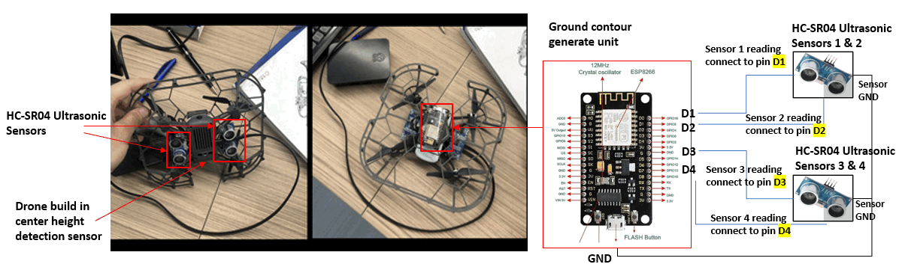

我們還開發了一個 UI 控制程式，具有所有木馬飛行控制功能，例如垂直/水平移動、飛行姿態（橫滾、俯仰、偏航）調整和追蹤路線。ESP8266 將 4 點無人機底部區域輪廓圖矩陣傳輸回控制程式，並且該資料與來自無人機底部高度感測器的讀數無縫整合，以提高無人機地形匹配功能的精確性和多功能性。控制程式 UI 和地形匹配邏輯如下所示：

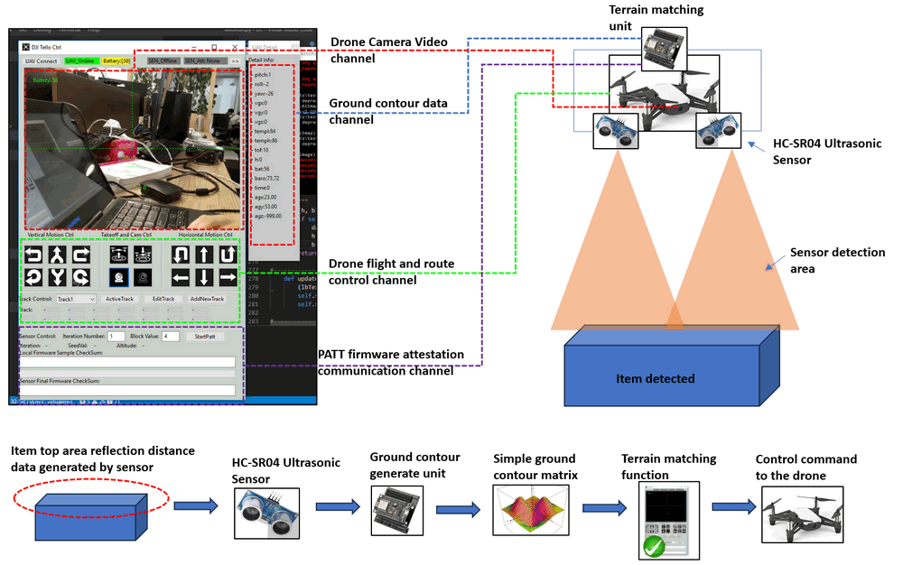

無人機控制器中的地形匹配模組，會仔細檢查生成的無人機底部區域輪廓圖，並與其預先建立的輪廓圖矩陣進行比較。如果差異低於預定義的閾值，則控制程式會識別出成功的「地形匹配」。在持續匹配 2 秒後，控制程式會啟動無人機的預設飛行動作時間表或路線劇本的執行。這可能包括特定指令，例如指示無人機在識別的表面上執行著陸動作。

 

#### 2.1 OT/IoT 韌體攻擊

**韌體攻擊** 是任何惡意程式碼，透過使用處理器軟體中的後門進入您的裝置。後門是程式碼中的路徑，允許某些人繞過安全性並進入系統。後門通常由於其高度複雜性而未被檢測到，但如果被 [駭客](https://netacea.com/blog/crackers-arent-hackers/) 利用，可能會導致嚴重的後果。

韌體攻擊的一個常見例子是您的電腦或手機上未經授權的更新，導致 [惡意軟體](https://netacea.com/glossary/malware/) 或其他形式的網路犯罪活動。這是因為許多更新都包含具有未記錄功能或功能的後門，這些後門可用於不利的行為，例如在未經通知的情況下攔截資料和關閉核心功能；所有這些都仍然偽裝成一個無辜的更新過程。

參考連結：https://netacea.com/glossary/firmware-attack/

在攻擊演示過程中，紅隊攻擊者的重點是地面輪廓生成單元的韌體，如前一節所示。該攻擊涉及將惡意程式碼注入到負責從距離感測器讀取資料的韌體部分，引入隨機偏移以扭曲真實資料並擾亂地面輪廓生成過程。在攻擊之前，無人機遵循預定義的飛行模式，直線飛行，直到它識別出另一個與其預先儲存的地面輪廓相匹配的桌子（解釋為安全的著陸位置），然後它繼續降落。但是，在韌體攻擊後，被操縱的地面輪廓生成結果導致無人機將不安全的區域視為匹配的輪廓。（如演示影片所示）

 

#### 2.2 PAtt：基於物理的控制系統認證

PAtt 旨在對在 PLC 上運行的邏輯程式碼進行遠端韌體認證，而無需傳統的信任錨點（例如 TPM 或 PUF）。對於 PAtt：基於物理的控制系統認證，請參閱 Hamid Reza Ghaeini 博士和 Jianying Zhou 教授的論文：https://www.usenix.org/system/files/raid2019-ghaeini.pdf

在我們的專案中，我們遵循論文中介紹的「Nonce 儲存和雜湊計算」的思想，以動態計算韌體的漢明雜湊，其中 `k=4` 以驗證在 ESP8266 Arduino 上運行的韌體。


------

### 3. 系統設計

在本節中，我們將概述系統的設計，該系統包含四個主要元件：

- 無人機控制器主 UI 設計
- 通訊協定設計
- 惡意程式碼和韌體攻擊的設計
- PATT 韌體認證的設計

 

#### 3.1 無人機控制器 UI 設計

無人機控制器包含不同的功能面板，旨在使無人機操作員能夠全面控制無人機的飛行。它有助於設定飛行路線、載入地形匹配設定檔以及監控輪廓生成單元資料。無人機控制器的主要執行緒啟動三個並行的子執行緒，每個執行緒都專用於重要的任務 - 與 Arduino 通訊以進行資料檢索和韌體認證、讀取 Tello-Drone 狀態資料以及獲取 Tello 的 UDP 視訊串流。同時，主執行緒管理 Tello 飛行控制。無人機控制器的使用者介面具有六個主要面板，詳細資訊如下：

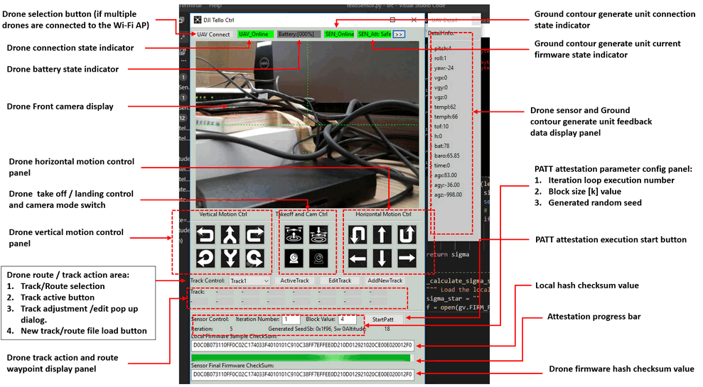

無人機控制 UI 包含 6 個不同的功能面板：

- **無人機狀態面板**：此面板位於頂部，使無人機操作員能夠選擇無人機，檢查關鍵資訊，例如無人機連線狀態、電池電量、地面輪廓生成單元連線狀態、韌體認證狀態，並提供無人機前置攝影機的即時檢視。
- **無人機飛行控制面板**：此面板專為手動飛行控制而設計，使無人機飛行員能夠管理無人機的垂直和水平移動、調整橫滾、俯仰和偏航、執行起飛和著陸動作以及切換攝影機的開啟和關閉。
- **無人機自動駕駛控制面板**：此面板專用於自動飛行操作，使無人機操作員能夠引導無人機沿著預設路線以自動跟隨模式飛行、編輯或載入軌跡設定檔、載入地形匹配設定檔以及視覺化航點和自動動作詳細資訊。
- **地面輪廓產生器資訊面板**：此面板顯示來自所有無人機感測器和地面輪廓產生器單元的全面回饋資料，提供用於監控和分析的重要資訊。
- **PATT 參數設定面板**：此面板專為設定韌體 PATT 雜湊計算參數而設計，使無人機操作員能夠啟動一輪認證進度。
- **PATT 結果顯示面板**：此面板提供認證進度的視覺表示，具有進度列。它還會在認證過程完成後，顯示本機 PATT 雜湊計算結果和無人機端韌體 PATT 雜湊結果。


#### 3.2 通訊協定設計

無人機控制電腦透過兩個不同的 WIFI 連結與無人機建立連線：

- **無人機通訊連結**：無人機自主作為 WIFI 存取點 (AP)，允許透過 WIFI 直接連接到控制器，以實現無縫的無人機飛行控制。
- **地面輪廓產生器連結**：由配備 WIFI 模組（客戶端）的 ESP8266 Arduino 促成，此連結連接到 WIFI AP。 Arduino 登入 WIFI 路由器，而路由器又透過乙太網路線連接到控制電腦。 此設定建立了地面輪廓產生器和控制電腦之間進行資料交換的可靠連結。

通訊連結如下所示：

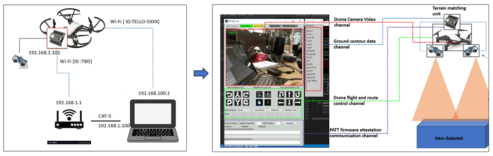

如上圖所示，無人機控制器電腦和無人機之間有 4 個無線通道。 控制中心（電腦）將透過 UDP 與無人機通訊，並透過 TCP 獲取地面輪廓產生器的回饋資料。 通道詳細資訊如下所示：

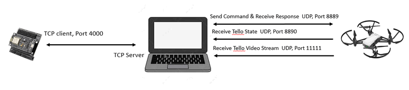

| 通道名稱               | 資料流                                                       | 目標                       | 協定           | 埠    |
| :--------------------- | :----------------------------------------------------------- | :------------------------- | :------------- | :---- |
| 地面輪廓產生器資料通道 | 從感測器獲取地面輪廓矩陣資料                                 | Arduino_IP (192.168.1.101) | TCP            | 4000  |
| 無人機運動控制通道     | 傳送無人機飛行控制指令並接收回應                             | Tello_Drone(192.168.10.1)  | UDP            | 8889  |
| 無人機感測器資料通道   | 獲取無人機內建的底部高度感測器、飛行感測器、電池、陀螺儀資料 | Tello_Drone(192.168.10.1)  | UDP            | 8890  |
| 無人機視訊通道         | 無人機前置相機視訊                                           | Tello_Drone(192.168.10.1)  | UDP H264 video | 11111 |

地面輪廓產生器韌體認證通訊與地面輪廓產生器資料通道共用同一個通道。 因此，當認證過程啟動時，地面輪廓產生功能會暫時停止資料傳輸，以允許通道用於傳輸 PATT 資料。 這種同步確保了在認證階段有效率且協調的資訊交換，而不會受到正在進行的資料傳輸的干擾。

 

| 該程式將透過 TCP 連接到 Arduino，並透過 UDP 與無人機通訊     |
| :----------------------------------------------------------- |
| **Arduino 控制**：Arduino_IP: 192.168.1.101, TCP_PORT: 4000 <<- ->> PC_IP: 192.168.1.100 TCP_PORT: 4000 |
| **無人機控制**（傳送指令並接收回應）：Tello_IP: 192.168.10.1 UDP_PORT:8889 <<- ->> PC/Mac/Mobile_IP: 192.168.10.xx UDP_PORT:8889 |
| **無人機控制**（接收 Tello 狀態）：Tello_IP: 192.168.10.1 UDP_PORT:8890 ->> PC/Mac/Mobile_ UDP_Server: 0.0.0.0, UDP PORT:8890 |
| **無人機控制**（接收 Tello 視訊串流）：Tello_IP: 192.168.10.1, UDP_PORT:11111->> PC/Mac/Mobile_UDP_Server: 0.0.0.0, UDP_PORT:11111 |


#### 3.3 惡意程式碼和韌體攻擊的設計

紅隊攻擊者按照以下概述的步驟執行韌體攻擊：

攻擊者首先從授權的韌體伺服器下載標準韌體檔案 `esp_client.ino.generic.bin`。

攻擊者利用逆向工程工具反編譯二進位檔案，以提取韌體 C++ 原始碼的一部分。

透過對程式碼進行徹底分析，攻擊者識別出用於距離計算的方法——利用感測器產生聲音脈衝，測量傳送脈衝和接收回音之間的時間間隔，然後將時間乘以聲速並除以 2。 透過對底層邏輯的全面理解，紅隊攻擊者將惡意程式碼引入韌體，如下所示：

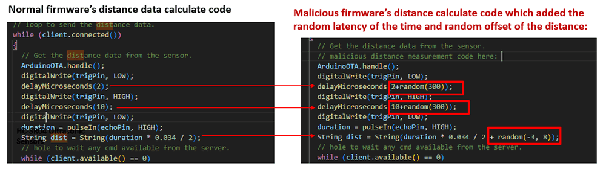

在引入的惡意程式碼中，攻擊者策略性地在脈衝前後插入隨機延遲（範圍從 0 到 300 微秒），從而導致回音時間不一致。 此外，將 -3 到 8 範圍內的隨機值新增到距離結果中，從而對最終測量值產生可變的偏移量，範圍在 -30 公分到 80 公分之間。

隨後，在合併了惡意變更後，攻擊者會編譯具有欺騙性的韌體，並透過偽造的地面輪廓產生器單元韌體更新電子郵件將其傳送給無人機維護工程師。

收到韌體後，維護工程師會繼續將其載入到地面輪廓產生器單元上。 開機後，該單元會提供一些回饋資料。 由於工程師沒有啟動無人機起飛，因此距離資料表面上看起來是正常的，這使他認為韌體的運作符合預期——沒有意識到底層的惡意變更。 發送回控制器的輪廓圖中的差異變得明顯，如下所示：

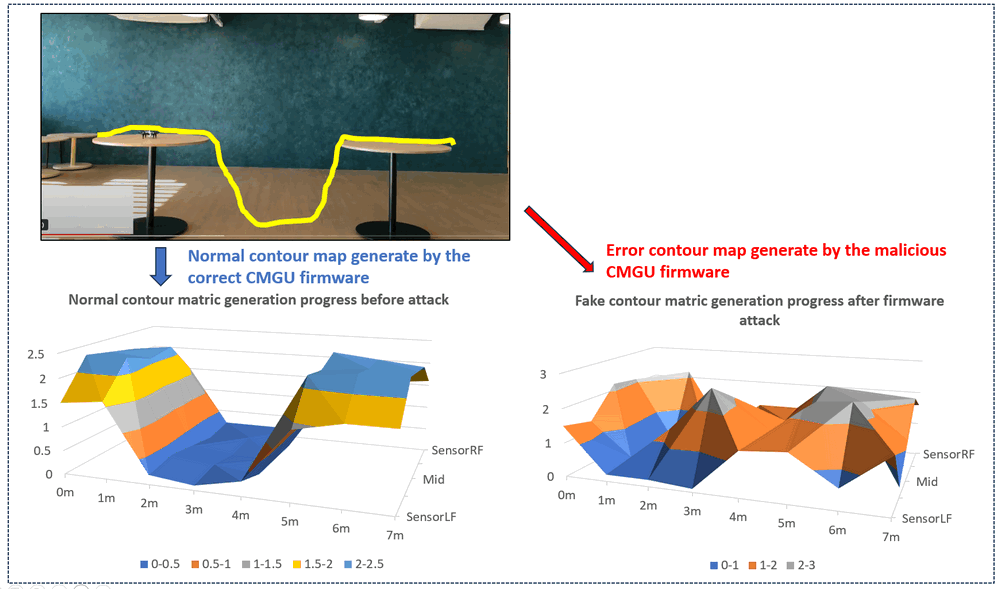

在無人機負責將物品從一張桌子轉移到另一張桌子的操作任務中，出現了一個嚴重的問題。 當無人機起飛時，其地面輪廓產生器單元會持續產生具有欺騙性的距離資料。 這種資料差異導致無人機做出不準確的著陸決策，導致意外著陸在地面上，或者在更嚴重的情況下，導致墜毀。

#### 3.4 體認證的設計

為了驗證韌體，控制電腦端也會保留韌體儲存庫，其中包含有效不同版本韌體的副本，並模擬將韌體載入到與 Arduino 相同的記憶體中。 詳細的認證步驟概述如下：

- 在韌體認證開始時，控制器會從 Arduino 獲取韌體版本和序號。 利用此資訊，控制程式會查詢其資料庫以檢索相應的正確韌體、韌體記憶體配置以及用於產生隨機記憶體位址清單的函數。
- 在收集到必要的資料後，控制器會產生一個「雙生」記憶體地圖，該地圖鏡像目標記憶體，並將韌體載入到此虛擬記憶體中。 完成這些準備工作後，會建立一個隨機種子並將其傳輸到 Arduino。
- 控制器和韌體都採用相同的隨機種子和用於產生隨機記憶體位址清單的函數來建立相同的清單。 清單完成後，控制器和 Arduino 都會計算清單中每個位址的漢明距離 (Ham(a, b))。 假設清單中的位址是，例如，`0x7FFF5FBFFD98`，「a」表示從 `0x7FFF5FBFFD98` 到 `0x7FFF5FBFFD98+k` 的內容。 在計算所有 Ham(a, b) 值後，將它們組合起來以獲得單輪迭代的雜湊值。 根據迭代參數設定，在完成所有迭代後，所有雜湊值將組合在一起以產生最終的 PATT 檢查和值。
- Arduino 透過地面輪廓資料通道將計算出的 PATT 檢查和傳送回控制器。 如果收到的檢查和與控制器的檢查和相符，則韌體認證被視為成功。 相反地，兩個檢查和之間的任何差異都表示檢測到韌體攻擊。

主要通訊流程如下所示（系統執行工作流程 UML 圖）：

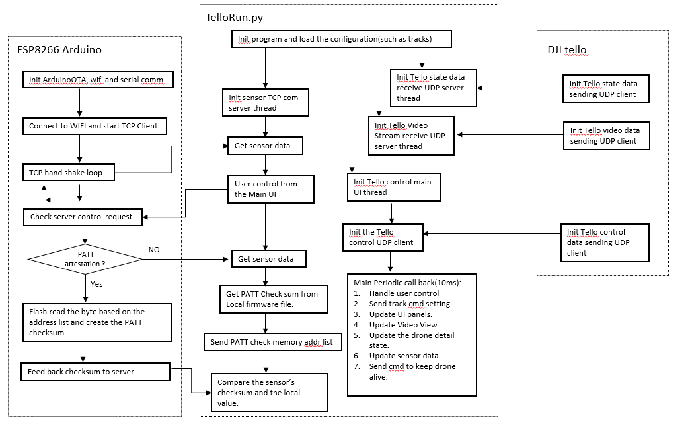


------

### 4. 程式設定

##### 4.1.1 開發環境

Python 3.7.4, C++

##### 4.1.2 需要的其他 Lib

1. wxPython 4.0.6（需要安裝才能進行 UI 構建）[> 連結](https://wxpython.org/pages/downloads/index.html:)

```
pip install -U wxPython 
```

1. OpenCV：opencv-python 4.1.1.26（需要安裝才能進行 H264 視訊串流解碼）[> 連結](https://pypi.org/project/opencv-python/)

```
pip install opencv-python
```

##### 4.1.3 需要的硬體

我們使用 DJI Tello Drone、ESP8266 Arduino 和 HC-SR04 Ultrasonic Sensor 來構建系統：

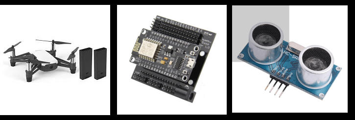

- **DJI Tello Drone**：DJI tello 控制 SDK[> 連結](https://www.ryzerobotics.com/tello/downloads )
- **ESP8266 Arduino**：ESP8266 Arduino 開發文件[> 連結](https://arduino-esp8266.readthedocs.io/en/latest/)
- **HC-SR04 Ultrasonic Sensor**：產品功能文件[> 連結](https://cdn.sparkfun.com/datasheets/Sensors/Proximity/HCSR04.pdf)

##### 4.1.4 程式檔案清單

| 程式檔案              | 執行環境    | 描述                                                         |
| :-------------------- | :---------- | :----------------------------------------------------------- |
| esp_client.ino        | C(Arduino)  | 此模組將啟動 TCP 客戶端以將 HC-SR04 Ultrasonic Sensor 讀數傳送到伺服器，並傳送韌體檢查和以進行認證。 |
| esp_client_attack.ino | C(Arduino)  | 攻擊韌體：它具有與檔案 相同的功能，但是如果我們編譯此程式並將韌體載入到 Arduino 中，則感測器回饋將設定為固定數字。 |
| telloGlobal.py        | python3.7.4 | 此模組用作本機設定檔，用於設定將在其他模組中使用的常數和全域參數。 |
| TelloPanel.py         | python 3.7  | 此模組用於為 UAV 系統（無人機控制和感測器韌體認證）建立控制和顯示面板。 |
| TelloRun.py           | python 3.7  | 此模組用於為 DJI Tello Drone 建立控制器，並連接到 Arduino_ESP8266 以獲取高度感測器資料。 |
| telloSensor.py        | python 3.7  | 此模組用於建立 TCP 通訊伺服器以接收 Arduino_ESP8266 高度資料並執行 PATT 認證。 |
| TrackPath.txt         |             | 編輯無人機飛行路徑。                                         |


------

### 5. 程式用法/執行

##### 5.1.1 執行程式

按照「WIFI 連線圖」部分將感測器和無人機連接到您的電腦。 然後透過以下命令執行 `src` 資料夾下的程式 telloRun.py：

```
python telloRun.py
```

程式初始化完成後，以下訊息將顯示在您的終端機中：

```
"Program init finished."
```

然後主要 UI 將如下所示：

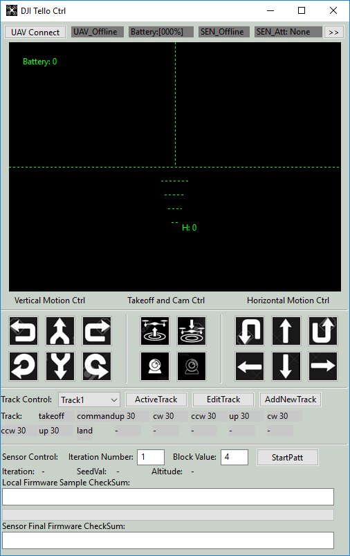

##### 5.1.2 載入地面矩陣檔案

為了啟動地形匹配功能，無人機操作員需要將設定檔的 `Terrain Matching Flag` 變更為 `True`，之後當啟動 UI 時，載入按鈕將會顯示。 然後按下「loadCont」按鈕，計數檔案選擇對話方塊將會彈出，如下所示：

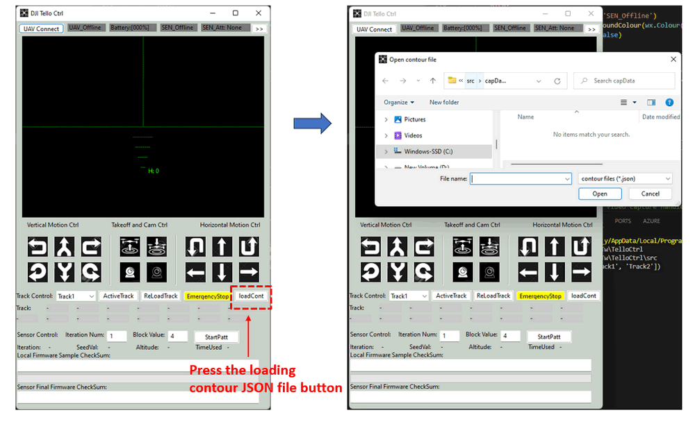

然後選擇您希望無人機在追蹤路線期間匹配的輪廓 JSON 檔案，一個簡單的輪廓範例如下所示：

```
{
    "sensorLF"  : [1.33, 1.23]  # 無人機左前感測器讀數
    "sensorLB"  : [1.33, 1.24]  # 無人機左後感測器讀數
    "sensorMD"  : [1.12, 1.20]  # 無人機中間高度感測器讀數
    "sensorRF"  : [1.33, 1.23]  # 無人機右前感測器讀數
    "sensorRB"  : [1.33, 1.24]  # 無人機右後感測器讀數
    "threshold" : 0.15          # 匹配閾值
    "matchingT" : 2             # 觸發匹配的時間（秒）
    "tackID"    : "trackLanding" # 地形匹配後要執行的追蹤。
}
```


##### 5.1.3 無人機控制和 PATT 韌體認證

無人機操作員可以在無人機飛行期間執行韌體認證，但我們建議無人機操作員在無人機起飛前執行認證。 執行一次認證的詳細步驟如下所示：

1. 按一下標題行下的「**UAV Connect**」按鈕，然後選擇無人機 WIFI AP，如果完成正確回應，則 UI 中的「無人機狀態」指示器將變為綠色，並且指示器將顯示「**UAV_Online**」。
2. 感測器將自動連接到程式。 當 ESP8266 Arduino 連接到程式時，感測器指示器將變為綠色並顯示「**SEN_Online**」。
3. 按下「**Takeoff and Cam Ctrl**」下的白色「**Camera**」按鈕將開啟無人機的前置相機。
4. 最新的電池讀數將顯示在前方相機檢視面板的左上角，無人機的高度將顯示在最低天際線水平指示器的右側。 標題列中顯示的電池讀數是過去 10 秒內的平均讀數。
5. 無人機追蹤路徑規劃：
   - 新增追蹤：開啟追蹤記錄檔案「`TrackPath.txt`」（位於 `src` 資料夾下），然後透過以下格式新增追蹤：

>  TrackName**;**action 1**;**action x**;**action x**;**action x**;**action x**;**action x**;**land（範例：*Track1;takeoff;command;up 30;ccw 30;up 30;ccw 30;up 30;land*。

```
 > 如果您沒有設定 land cmd，程式將自動新增 land cmd。 關於動作設定部分，請查看 doc 資料夾下的 Tello SDK Documentation EN_1.3_1122.pdf 中的詳細無人機控制協定）
```

- 在下拉式選單中選擇追蹤，然後按一下「**Active track**」按鈕，所選追蹤將由無人機執行。 目前執行的動作將標記為綠色。

1. 感測器韌體認證控制：
   - 填寫您想要執行的認證次數和記憶體區塊大小，然後按下「**startPatt**」按鈕。 本機韌體和感測器韌體將會顯示並進行比較。 認證結果和用於認證過程的總時間將如下所示（認證過程將花費約 8 秒 ~ 10 秒）：

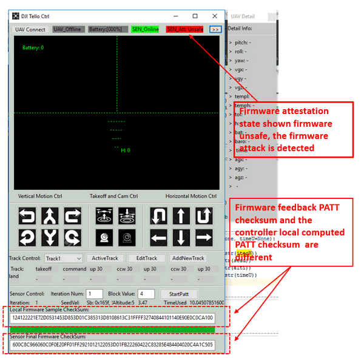

1. - 每個認證結果將以以下格式記錄在「checkSumRecord.txt」（來源資料夾）中：

     如以上範例所示，在執行認證後，PATT 檢查和記錄是不同的，如下所示：

     Local:`1400A0C126221302030000340C21865C1014050020C0313FBEE0CD0C0B073110FF0C02C174033F4010101C910C38FF7EFFEE0D210D012921020CE00E020012F0`

     Remote:`1400A0C126221302030000340C21865C1014050020C0313FBEE0CD0C0B073110FF0C02C174033F4010101C910C38FF7EFFEE0D210D012921020CE00E020012F0`

   - 這表示在無人機上執行的韌體與我們控制韌體儲存庫 DB 中的韌體不同（認證指示器將顯示紅色，並顯示「Sen_att: unsafe」），無人機正在使用未經授權的韌體，並且已偵測到韌體攻擊。 無人機可以停止任務以避免無人機事故。

2. 按下標題列下的「**>>**」按鈕，無人機詳細狀態資訊顯示視窗將在右側彈出。


------

### 6 問題和解決方案

不適用


------

### 7. 參考文獻

PATT 韌體證明：

https://www.usenix.org/system/files/raid2019-ghaeini.pdf

**Thanks for reading, if you have any question and suggestion, please feel free to message me. Many thanks if you can give some comments and share any of the improvement advice so we can make our work better ~**

如果您對鐵路系統上的其他 OT 攻擊案例研究感興趣，請參考以下連結：

1. [案例研究 1：偽造資料/命令注入攻擊](https://www.linkedin.com/pulse/ot-cyber-attack-workshop-case-study-01-false-data-command-liu-hqtac%3FtrackingId=28DxJBLUTguN0Q8tJUDMiQ%3D%3D/?trackingId=28DxJBLUTguN0Q8tJUDMiQ%3D%3D)
2. [案例研究 2：OT 網路 ARP 欺騙攻擊](https://www.linkedin.com/pulse/ot-cyber-attack-workshop-case-study-02-arp-spoofing-hmi-yuancheng-liu-howzc%3FtrackingId=LuDJ7ZceQZ2t3HpUGkqCYA%3D%3D/?trackingId=LuDJ7ZceQZ2t3HpUGkqCYA%3D%3D)
3. [案例研究 3：Modbus 通道上的 DDoS 攻擊](https://www.linkedin.com/pulse/ot-cyber-attack-workshop-case-study-03-ddos-plc-yuancheng-liu-yi2cc%3FtrackingId=%2FouNxvl8RLWQNWo53N6fdw%3D%3D/?trackingId=%2FouNxvl8RLWQNWo53N6fdw%3D%3D)
4. [案例研究 4：HMI-PLC 控制鏈上的中間人攻擊](https://www.linkedin.com/pulse/ot-cyber-attack-workshop-case-study-04-mitm-hmi-plc-control-liu-wcobc%3FtrackingId=RcBsdjWWRrOS576fT3y8%2Bg%3D%3D/?trackingId=RcBsdjWWRrOS576fT3y8%2Bg%3D%3D)


------

1. ](https://www.linkedin.com/pulse/ot-cyber-attack-workshop-case-study-04-mitm-hmi-plc-control-liu-wcobc%3FtrackingId=RcBsdjWWRrOS576fT3y8%2Bg%3D%3D/?trackingId=RcBsdjWWRrOS576fT3y8%2Bg%3D%3D)

------

> Last edit by LiuYuancheng(liu_yuan_cheng@hotmail.com) at 30/04/2026, , if you have any problem please free to message me.