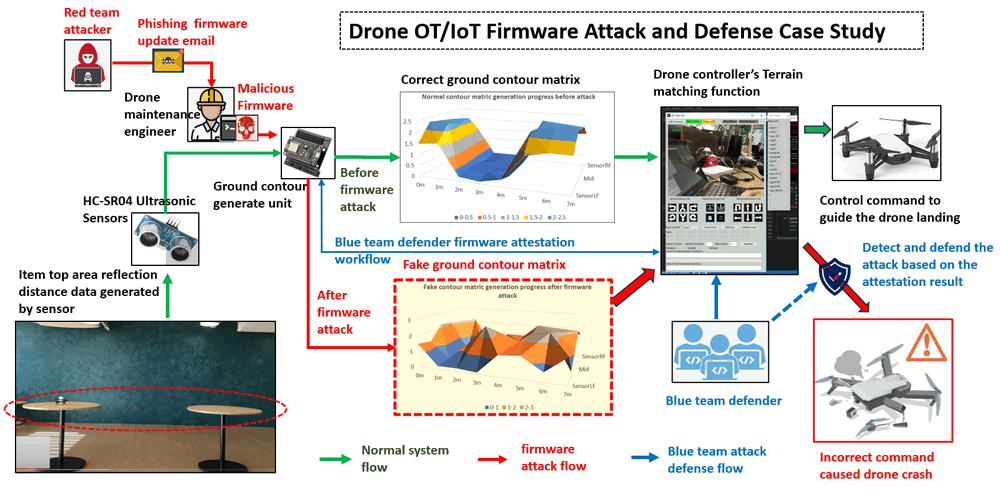
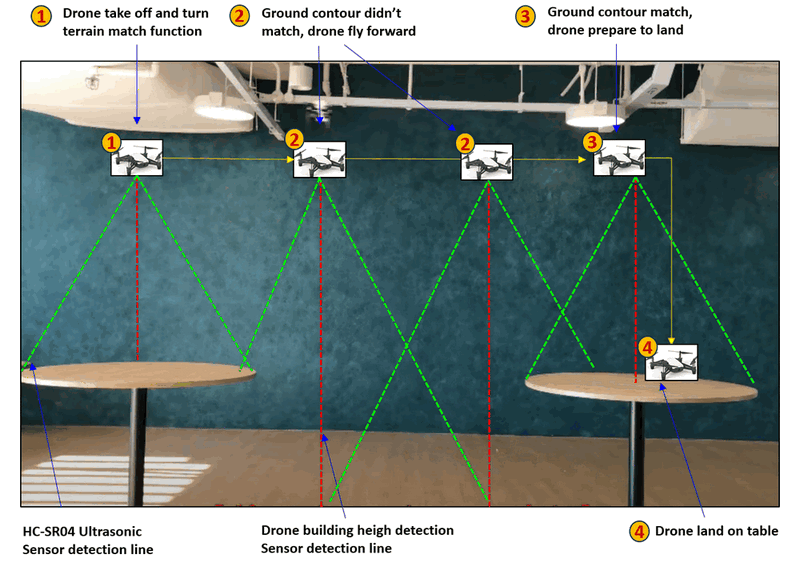
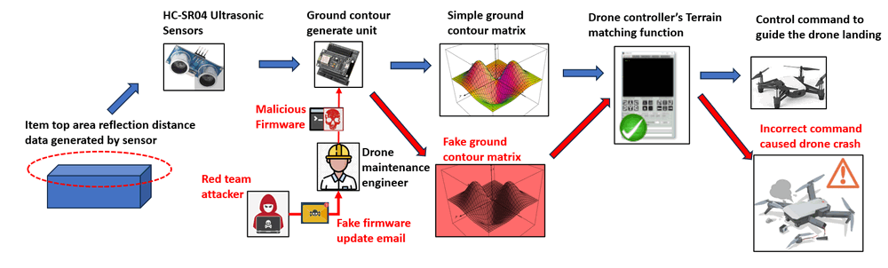
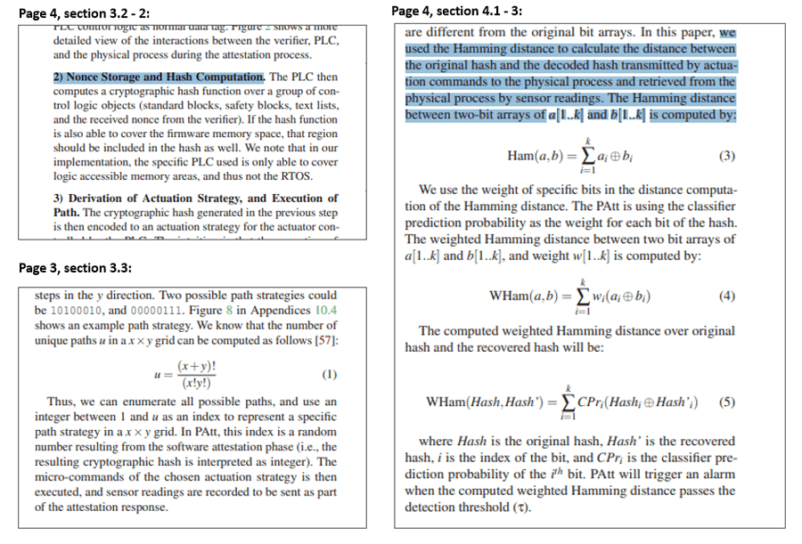

# DJI_Tello_Control_System Cyber Attack Case Study [ Drone Firmware Attack and Detection ]

[us English](README.md) | **cn 中文**

**專案設計目的**：本次網路攻擊案例研究的目標是開發一個工作坊，利用我們開發的地形匹配無人機系統和論文中介紹的動態韌體認證演算法 [PAtt: 基於物理的控制系統認證](https://www.usenix.org/system/files/raid2019-ghaeini.pdf)，來實際演示 OT/IoT 裝置韌體攻擊和相應的攻擊檢測機制。地形匹配無人機由一個 Arduino、四個距離感測器和一個 DJI Tello 無法編程的無人機組成。攻擊情境包括紅隊攻擊者將惡意程式碼注入到無人機的地形輪廓生成單元韌體中，擾亂無人機的自動著陸過程，並導致模擬的無人機墜毀。同時，本案例研究還展示了藍隊防禦者如何使用 PATT 韌體認證功能來即時識別韌體攻擊，防止事故發生，並突顯了在保護營運技術和物聯網裝置中，健全的防禦機制的重要性。



`version v0.2.1`

**攻擊者途徑**：韌體攻擊、惡意韌體更新 (OT)、IoT 供應鏈攻擊

重要提示：所演示的攻擊案例僅用於不同層級的 IT-OT 網路安全 ICS 課程的教育和培訓，請勿將其應用於任何真實世界的系統。

```python
# Author:      Yuancheng Liu
# Created:     2026/04/20
# version:     v_0.2.2
# Copyright:   Copyright (c) 2026 LiuYuancheng
# License:     MIT License  
```

**Table of Contents**

[TOC]

------

### 1. 項目簡介

本案例研究旨在開發一種智慧無人機系統，能夠模擬特定的工業 4.0 (I4.0) 無人機自動駕駛使用案例，包括自主追蹤路線、環境感知（地形匹配）、傳輸物品以及為後續行動做出決策。目標是演示營運技術 (OT) 韌體攻擊對此類系統的潛在影響。該專案分為三個主要部分：

- **攻擊演示平台：** 利用 DJI Tello 地形匹配無人機系統作為基礎平台，展示自動駕駛功能、潛在漏洞和攻擊情境。
- **韌體攻擊演示：** 著重於演示針對無人機地面輪廓圖生成單元的惡意韌體更新攻擊。此模擬將突顯惡意入侵影響系統有效執行任務的能力的後果。
- **攻擊檢測與防禦：** 實施基於物理的韌體認證 (PATT) 作為一種手段，來說明健全的防禦機制如何檢測和減輕韌體攻擊的影響。本節強調在工業 4.0 環境中，主動安全措施在保護無人機系統中的重要性。

#### 1.1 DJI Tello 地形匹配無人機控制

在本專案中，我們的目標是增強 DJI Tello 迷你無人機（本質上是無法編程的）的功能，以模擬工業無人機通常執行的動作，例如在工廠環境中，遵循預定義的路線和運輸物品。DJI Tello 無人機作為一個基本的無法編程的模型，需要額外的功能來模擬更複雜的任務。為了實現這一點，我們在無人機上集成了四個額外的超音波感測器，增強了其「檢測」更複雜環境的能力。自動駕駛控制由連接的電腦上運行的主無人機控制程式執行。

DJI Tello 的底部感測器，以及四個額外添加的距離感測器，協同生成無人機周圍環境的綜合「5 點」地面輪廓圖。位於控制電腦上的主無人機控制器，協調無人機的移動，以模擬自動駕駛動作，並根據獲取的輪廓圖資料，遵循預定義的路線。

DJI Tello 的底部感測器，以及四個額外添加的距離感測器，協同生成無人機周圍環境的綜合「5 點」地面輪廓圖。位於控制電腦上的主無人機控制器，協調無人機的移動，以模擬自動駕駛動作，並根據獲取的輪廓圖資料，遵循預定義的路線。例如，如果目標是讓無人機直線飛行，直到它檢測到一個類似桌子的物體在它下方，然後繼續降落在該桌子上（模擬將物品從一張桌子轉移到另一張桌子），無人機會不斷地將輪廓圖傳輸到控制程式。無人機控制程式分析接收到的輪廓矩陣，如果它與桌子的預定義特徵相匹配，它將向無人機發出著陸命令。典型的地形匹配過程如下圖所示：



**備註**：在本文件的程式設計部分，我們將提供 DJI Tello 無人機控制器程式的詳細概述。這個全面的討論將涵蓋基本方面，包括無人機基本運動控制的複雜使用、軌跡編輯的功能、地面簡單輪廓匹配過程以及無人機運動安全檢查功能。此資訊旨在為使用者提供必要的見解和工具，以便為無人機規劃和執行複雜的路線，確保無縫和安全的操作。

#### 1.2 韌體攻擊演示

在這個惡意韌體更新攻擊情境中，紅隊攻擊者的目標是在無人機的 CMGU（輪廓圖生成單元）上運行的韌體程式。CMGU 對於飛行環境監控和地形匹配至關重要，它包括一個 ESP8266 Arduino、一個電池和四個 HC-SR04 超音波感測器。在攻擊演示期間，紅隊攻擊者利用了 IoT 供應鏈中的一個漏洞，向一個疏忽的無人機維護工程師發送了一封欺騙性的韌體更新電子郵件，導致在輪廓圖生成單元中安裝了惡意韌體。這次攻擊突顯了保護 IoT 供應鏈以防止未經授權的韌體更改和潛在的營運中斷的至關重要性。攻擊路徑如下所示：



流氓韌體在手動無人機控制或遵循預定義路線時，表現得不顯眼。但是，當無人機啟動自動駕駛模式進行地面輪廓匹配時，它會啟動惡意功能。具體來說，韌體會引入隨機的「雜訊」距離資料，故意扭曲地面輪廓資訊的準確性。這種錯誤資訊會誤導無人機控制器，導致不正確的決策，並因此導致無人機事故，例如墜毀。

詳細演示影片：https://youtu.be/rRu1qrZohJY?si=g5fkKZf4Z8Osre6I

#### 1.3 Arduino 韌體認證

在本節中，我們將說明無人機操作員如何使用動態、即時的韌體認證，不僅可以檢測攻擊，還可以防止涉及無人機的潛在事故。為了實現這一點，我們採用了論文「PATT」（基於物理的控制系統認證）中概述的 PLC 韌體認證演算法的一部分，以驗證是否發生了韌體攻擊。我們將遵循論文中介紹的「Nonce 儲存和雜湊計算」部分，以動態計算韌體的漢明雜湊，其中 `k=4` 如下所示：



我們衷心感謝基於物理的控制系統認證論文的作者 Hamid Reza Ghaeini 博士和來自 [SUTD](https://www.sutd.edu.sg/) 的 Jianying Zhou 教授，他們介紹了高效且健全的韌體認證演算法。

基於物理的控制系統認證論文連結：https://www.usenix.org/system/files/raid2019-ghaeini.pdf

#### 1.4 攻擊的關鍵策略、技術和程序 (TTP)

根據攻擊演示部分中介紹的詳細攻擊路線圖，韌體攻擊情境中將包含兩種主要的 TTP：

##### 1.4.1 惡意韌體開發

- **策略：** 開發具有惡意功能的客製化韌體。
- **技術：** 修改現有韌體或建立包含後門、漏洞或其他惡意程式碼的新韌體。
- **程序：** 紅隊攻擊者修改了普通無人機的地形匹配單元的韌體，方法是在韌體中插入惡意程式碼而不被檢測到，確保它保持隱藏狀態，並且不會觸發安全機制。

##### 1.4.2 供應鏈入侵

- **策略：** 在製造或分銷過程中入侵無人機的韌體。
- **技術：** 滲透供應鏈，在無人機到達最終使用者之前插入惡意韌體。
- **程序：** 紅隊攻擊者建立一個假的軟體更新伺服器網站，並透過欺騙性的無人機韌體更新電子郵件將連結發送給無人機維護工程師，以引入並將受入侵的韌體注入到供應鏈中。該網站還將提供惡意韌體的 MD5 值，供維護工程師驗證未經授權的韌體更新套件。